# Proyecto 19: OdontoNova - Gestión Odontológica

## Descripción del Proyecto
OdontoNova es una solución integral orientada a la gestión clínica y administrativa odontológica. Integrará reserva de agenda, control de historias clínicas, planes de tratamiento, seguimiento de sesiones clínicas y administración de pagos.

---

## Estructura y Creación de la Base de Datos

La base de datos `odontonova_db` se construyó en **MySQL 8.0** desplegado mediante Docker bajo entorno WSL/Ubuntu, utilizando DBeaver como cliente SQL.

---

### Paso a Paso: Creación de Entidades

#### 1. Tabla `pacientes`
Almacena la información personal básica y de identificación del paciente.
* **Campos:** `id`, `tipo_documento`, `numero_documento` (UQ), `nombre`, `fecha_nacimiento`, `is_active`, `created_at`, `updated_at`.

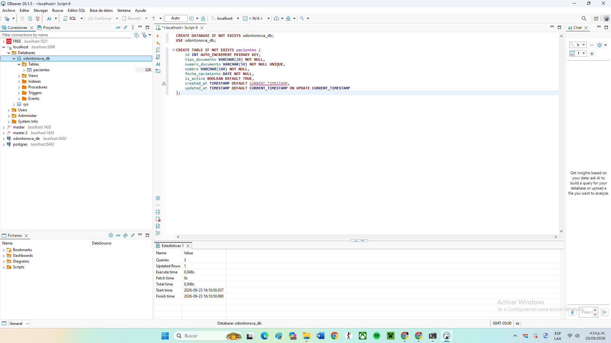

---

#### 2. Tabla `odontologos`
Registro de los profesionales de la salud dental encargados de la atención.
* **Campos:** `id`, `nombre`, `descripcion`, `is_active`, `created_at`, `updated_at`.

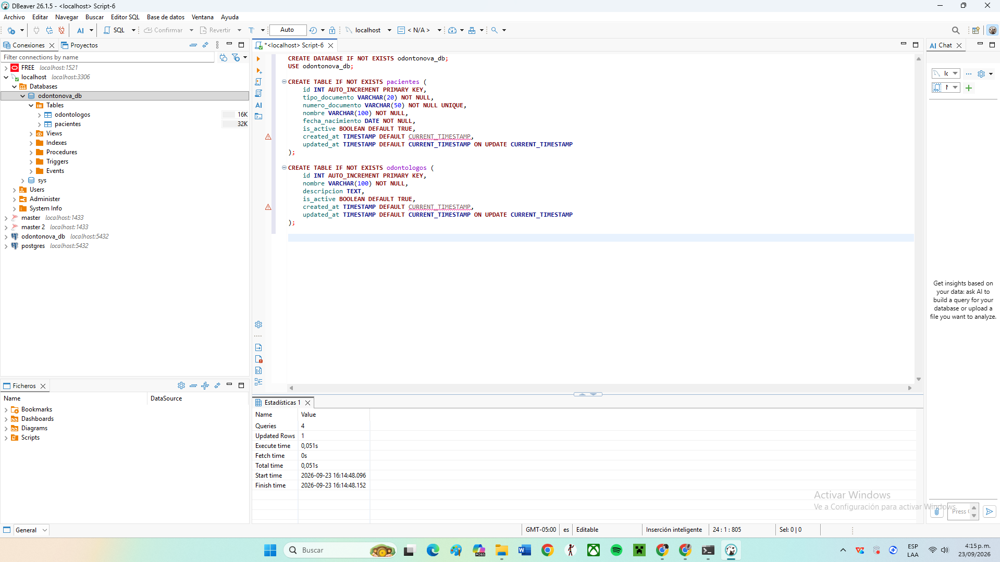

---

#### 3. Tabla `sillones`
Gestión de recursos físicos y consultorios para la programación de citas.
* **Campos:** `id`, `nombre`, `descripcion`, `is_active`, `created_at`, `updated_at`.

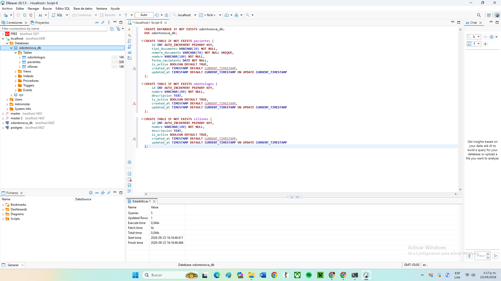

---

#### 4. Tabla `citas`
Agendamiento de atenciones vinculando paciente, odontólogo y sillón reservado.
* **Campos:** `id`, `paciente_id` (FK), `odontologo_id` (FK), `sillon_id` (FK), `fecha_inicio`, `fecha_fin`, `motivo`, `estado`, `created_at`, `updated_at`.

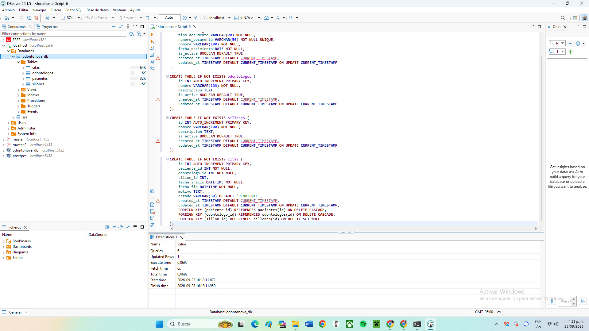

---

#### 5. Tabla `historias_clinicas`
Antecedentes y registro clínico permanente vinculado 1:1 con el paciente.
* **Campos:** `id`, `paciente_id` (FK, UQ), `nombre`, `descripcion`, `is_active`, `created_at`, `updated_at`.

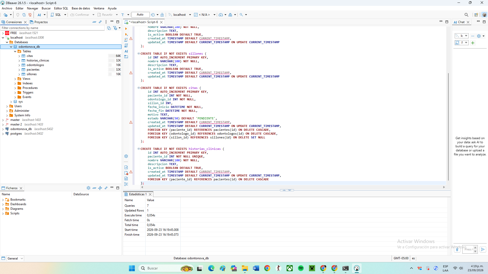

---

#### 6. Tabla `planes_tratamiento`
Planes de tratamiento propuestos y asignados a cada paciente (relación 1:N).
* **Campos:** `id`, `paciente_id` (FK), `nombre`, `descripcion`, `is_active`, `created_at`, `updated_at`.

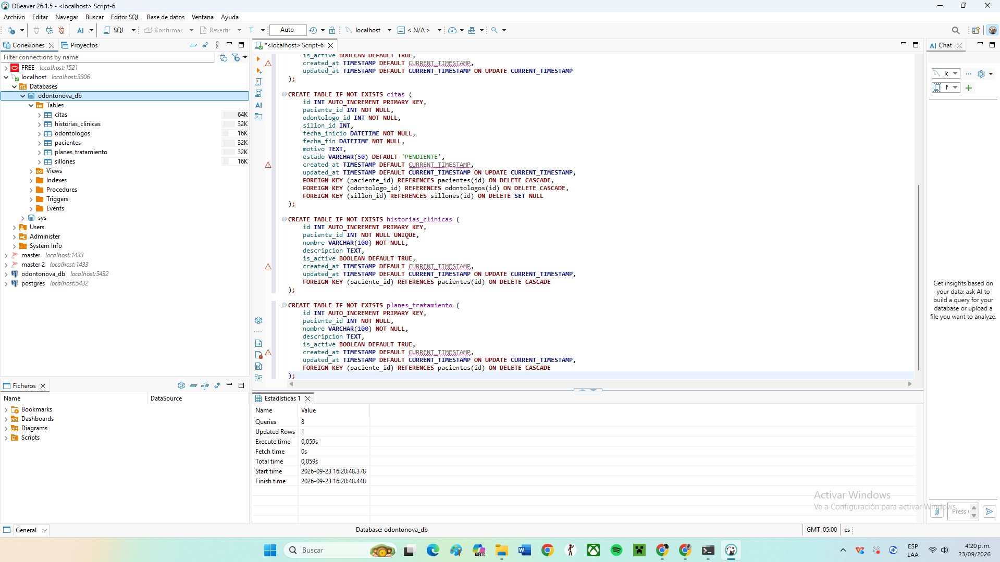

---

#### 7. Tabla `procedimientos`
Catálogo general de procedimientos odontológicos ofertados.
* **Campos:** `id`, `nombre`, `descripcion`, `is_active`, `created_at`, `updated_at`.

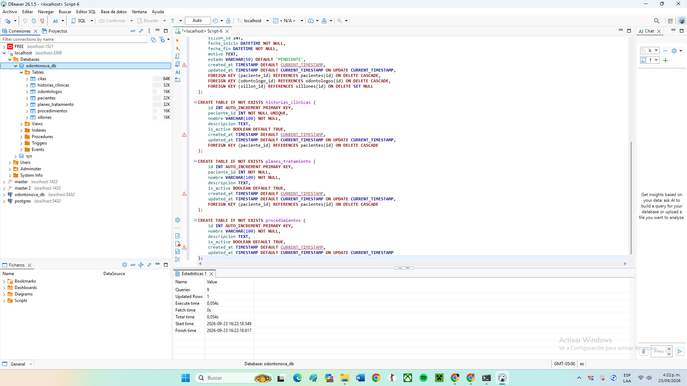

---

#### 8. Tabla `detalles_tratamiento`
Detalle de los procedimientos específicos incluidos en un plan de tratamiento.
* **Campos:** `id`, `cabecera_id` (FK), `item_id` (FK), `cantidad`, `valor_unitario`, `total`, `observacion`, `created_at`, `updated_at`.

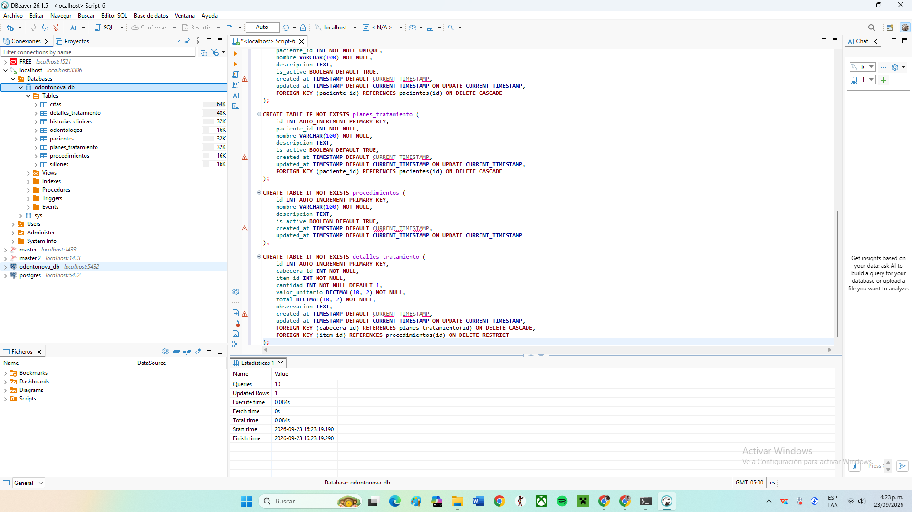

---

#### 9. Tabla `sesiones_clinicas`
Registro de atenciones o sesiones ejecutadas vinculadas a la cita correspondiente.
* **Campos:** `id`, `referencia_id` (FK), `fecha_inicio`, `fecha_fin`, `total`, `estado`, `observaciones`, `created_at`, `updated_at`.

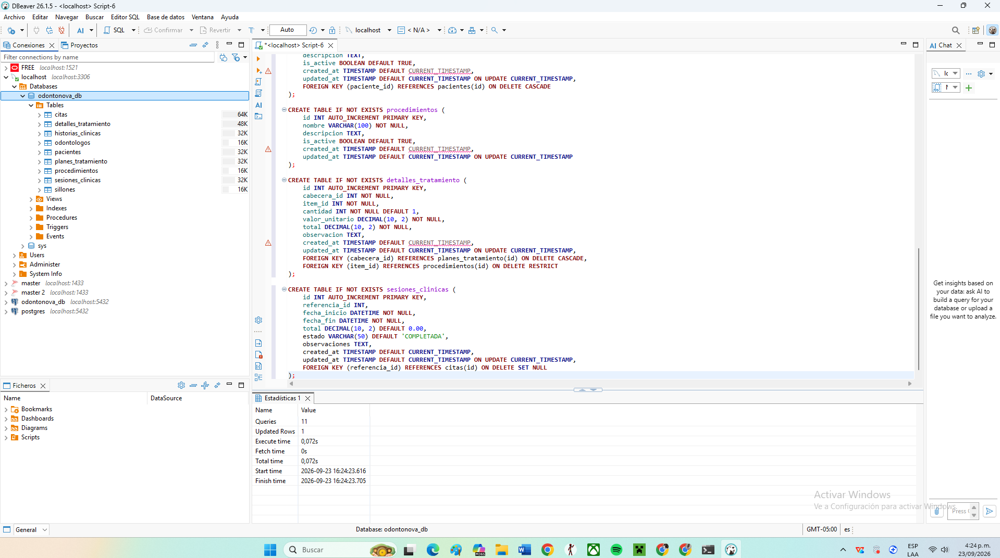

---

#### 10. Tabla `pagos`
Registro financiero de transacciones y abonos aplicados a los planes de tratamiento.
* **Campos:** `id`, `referencia_tipo`, `referencia_id` (FK), `metodo`, `monto`, `fecha`, `estado`, `created_at`, `updated_at`.

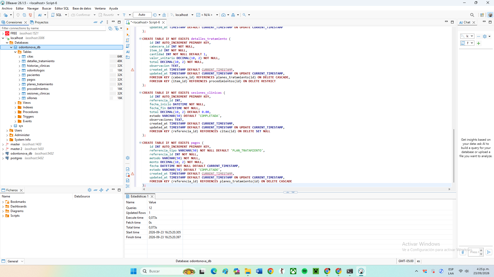

---

## Vista General del Esquema Creado

A continuación se evidencia el listado completo de las 10 tablas creadas e integradas dentro de la base de datos `odontonova_db`:

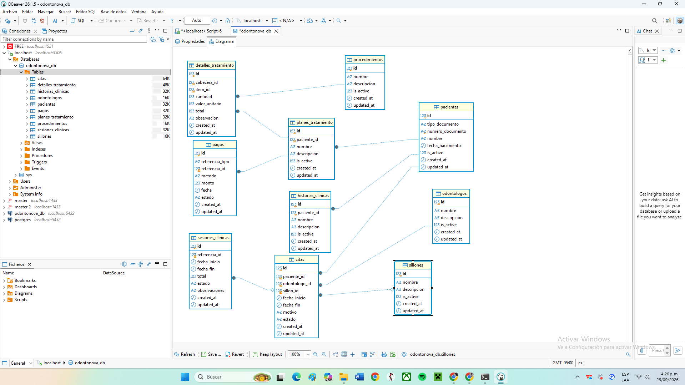
