# 🦷 Migración de OdontoNova a Oracle Database

Documentación y evidencias del proceso de migración del esquema de base de datos **OdontoNova** desde MySQL a **Oracle Database** utilizando DBeaver y Docker.

---

## 📌 1. Scripts SQL

* **`schema.sql`**: Definición de estructura (DDL) adaptada a sintaxis nativa de Oracle (`NUMBER GENERATED BY DEFAULT AS IDENTITY`, `VARCHAR2`, `CLOB`, `TIMESTAMP`).
* **`data.sql`**: Inserción de datos de prueba (DML) para la verificación de integridad relacional.

---

## 📸 2. Evidencias de Creación de Tablas (DDL)

### Tabla 1: Pacientes
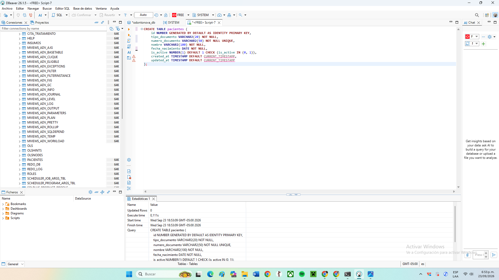

### Tabla 2: Odontólogos
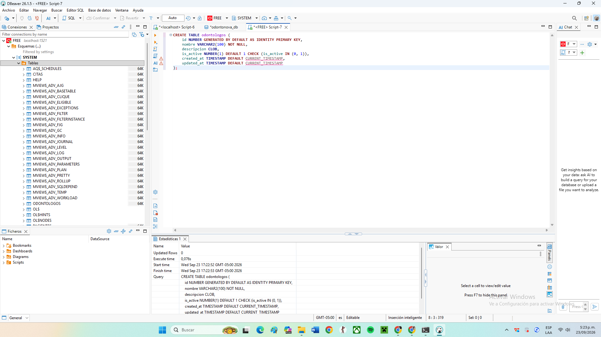

### Tabla 3: Sillones
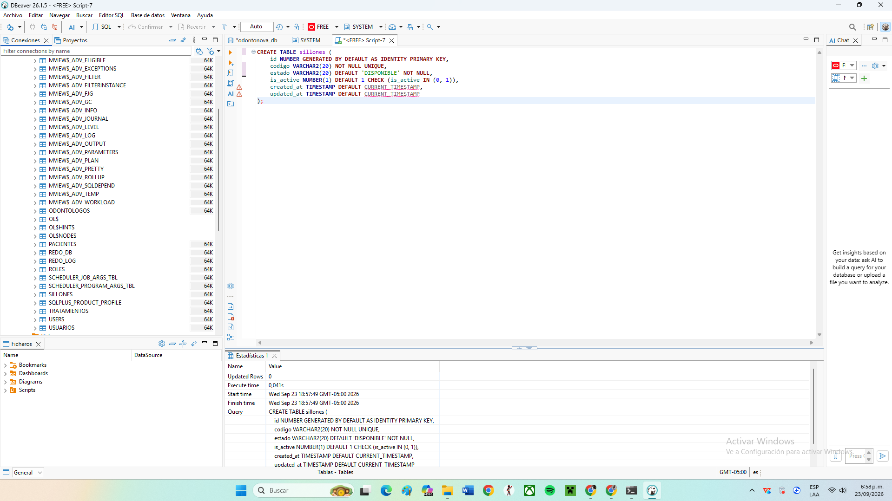

### Tabla 4: Citas
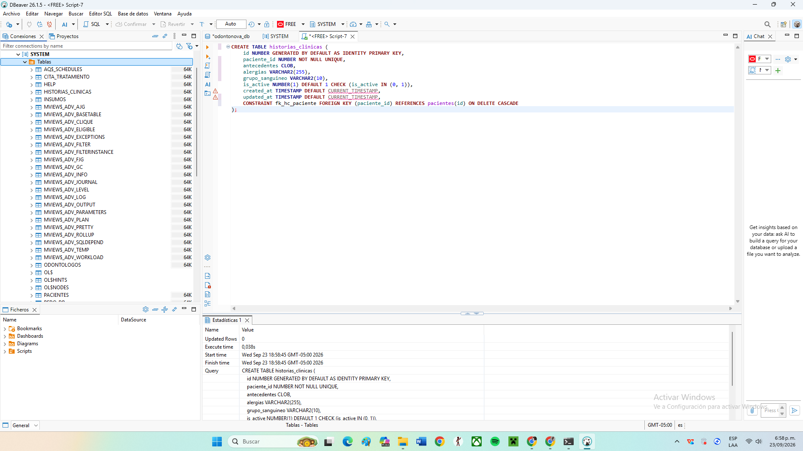

### Tabla 5: Tratamientos
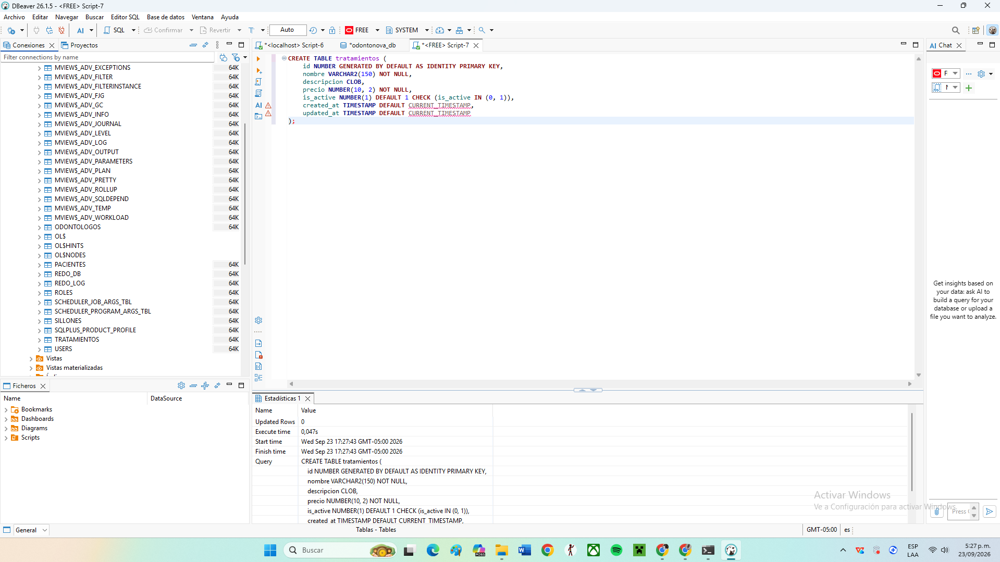

### Tabla 6: Cita Tratamiento
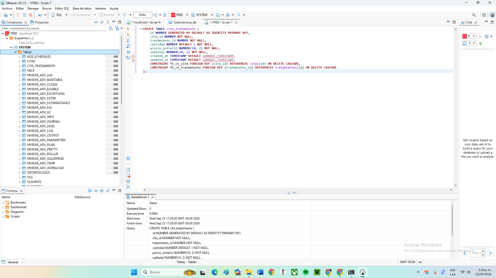

### Tabla 7: Historias Clínicas
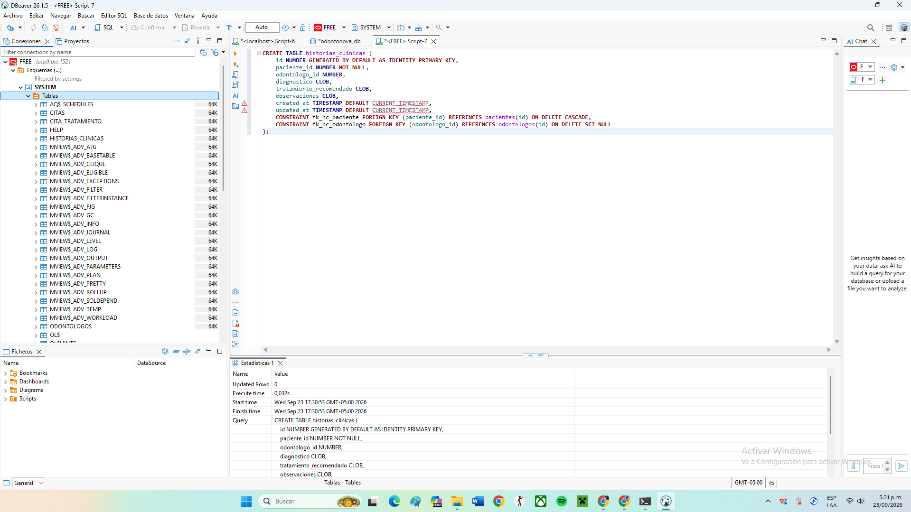

### Tabla 8: Pagos
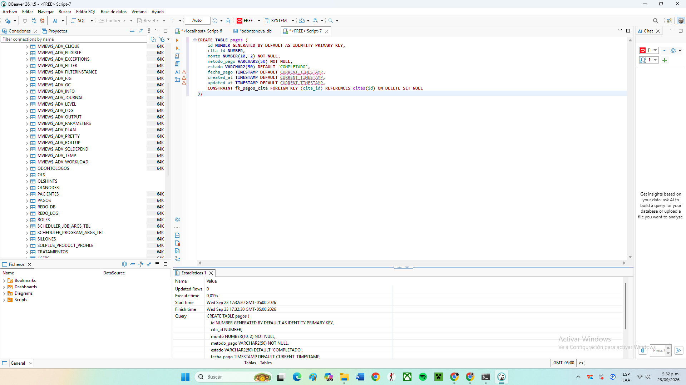

### Tabla 9: Usuarios
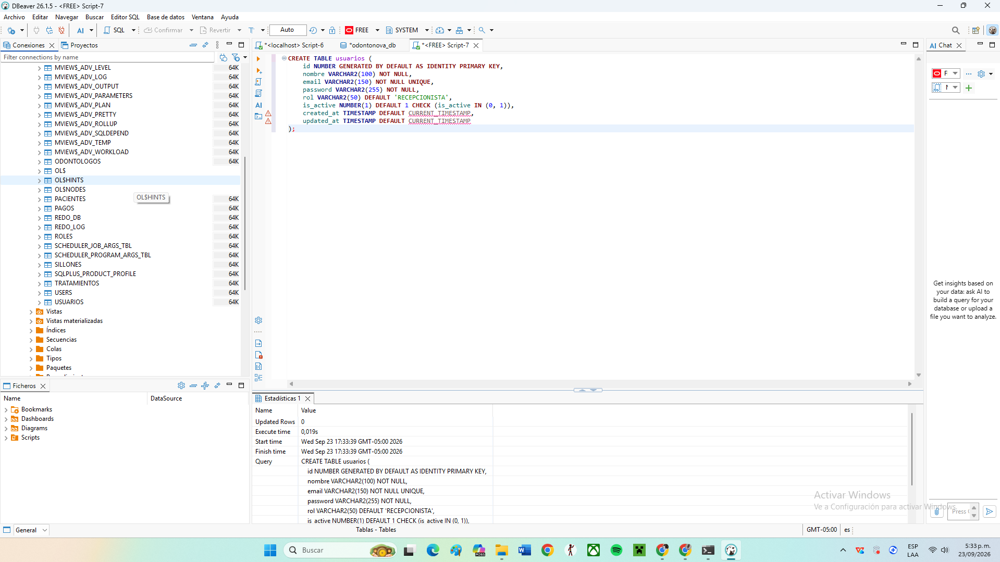

### Tabla 10: Insumos
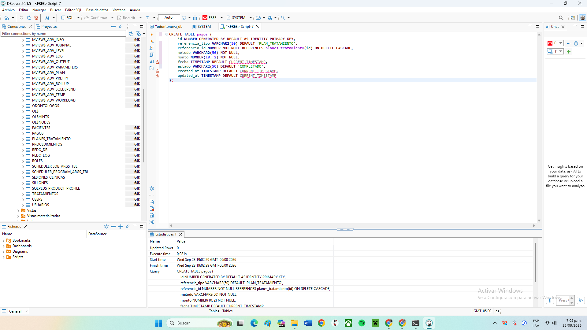

---

## 📊 3. Modelo Entidad-Relación (ERD)

Vista completa de las 10 tablas creadas en el esquema de Oracle Database con sus respectivas llaves primarias y foráneas:

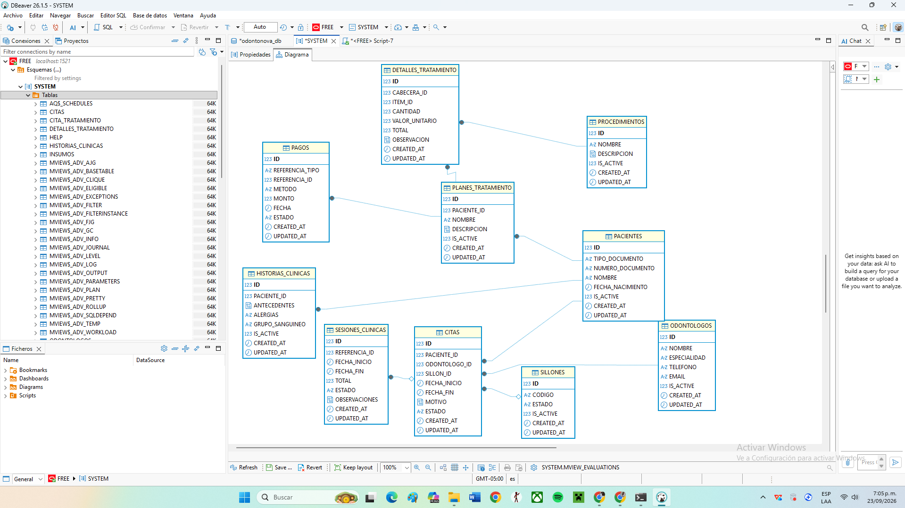
