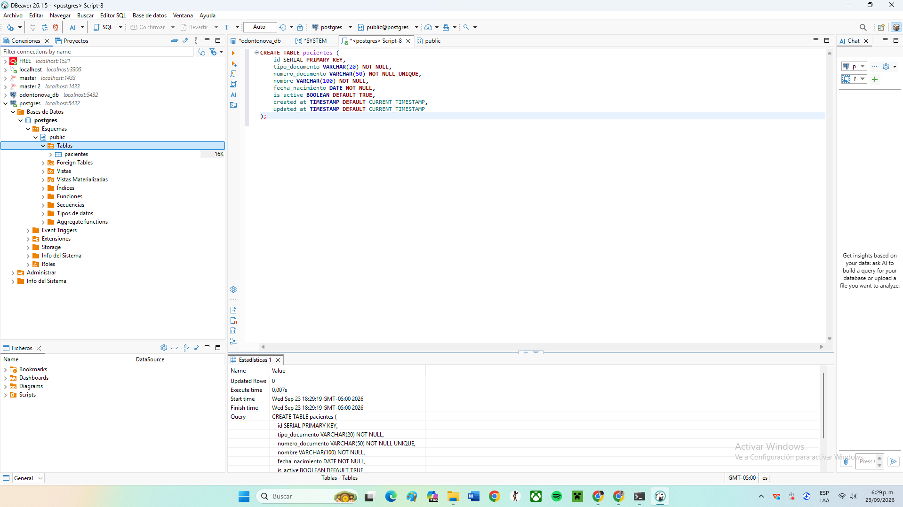
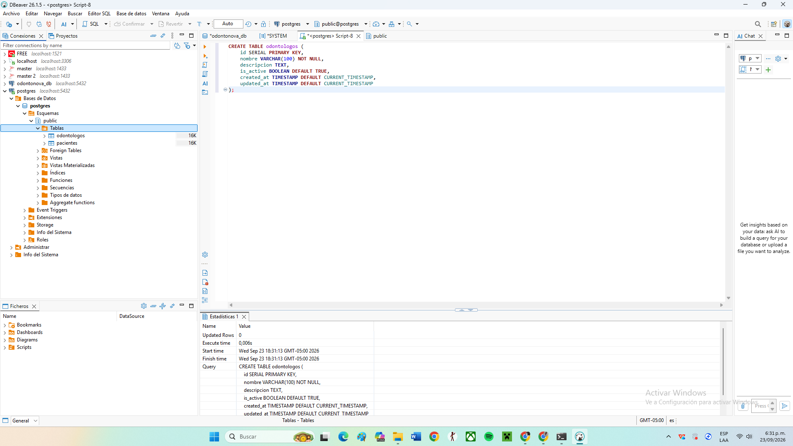
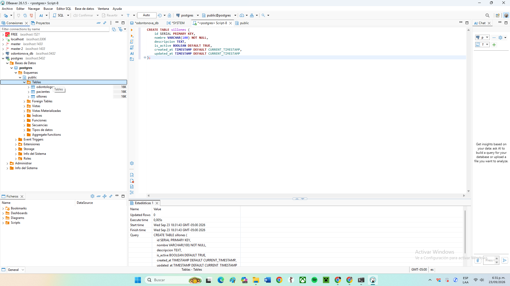
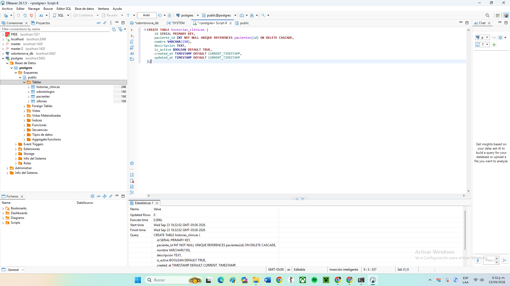
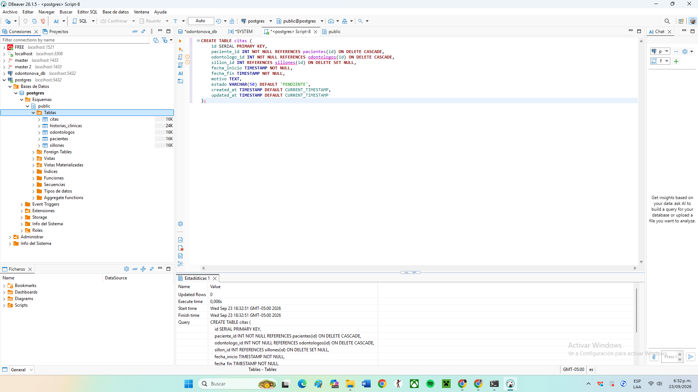
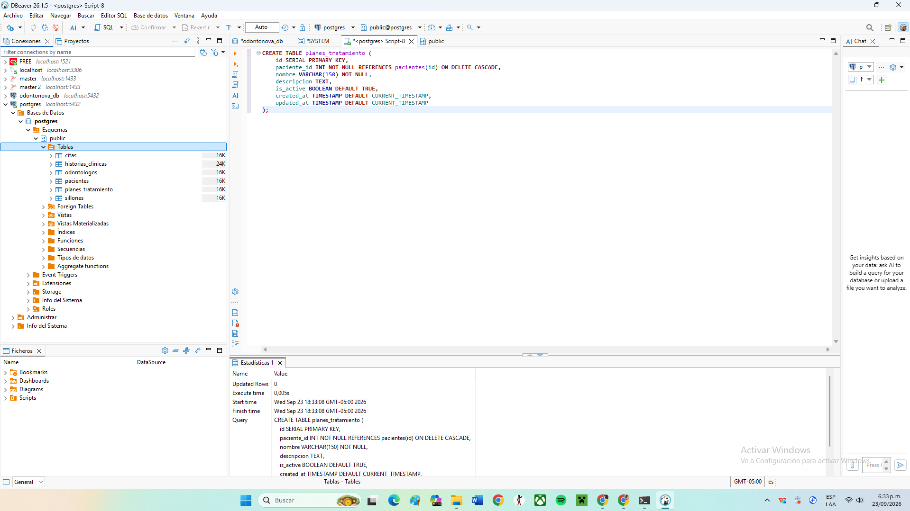
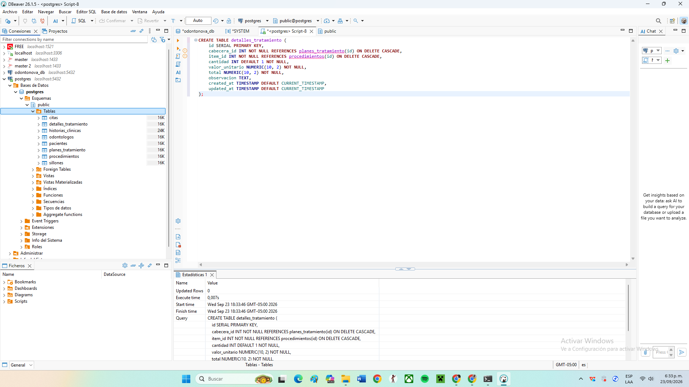
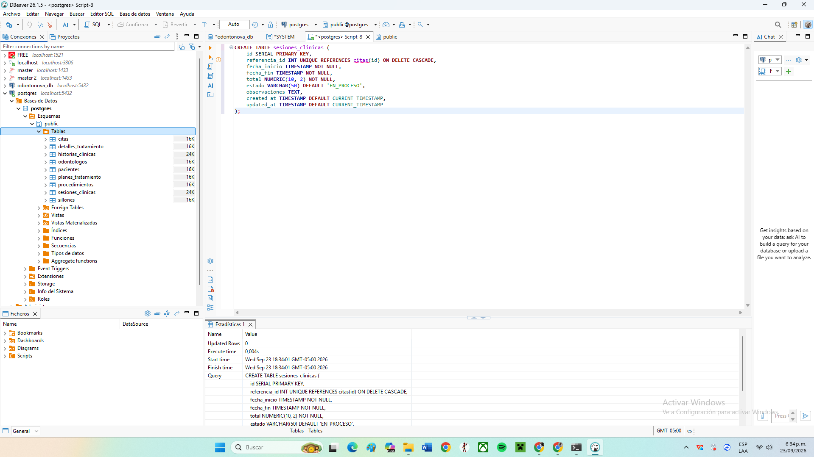
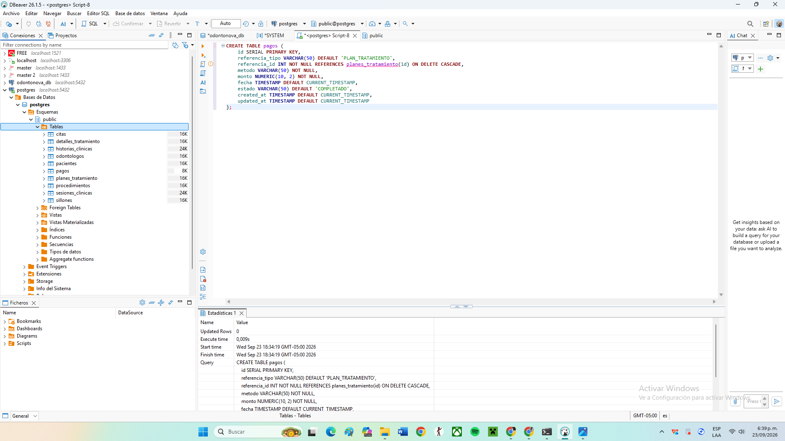
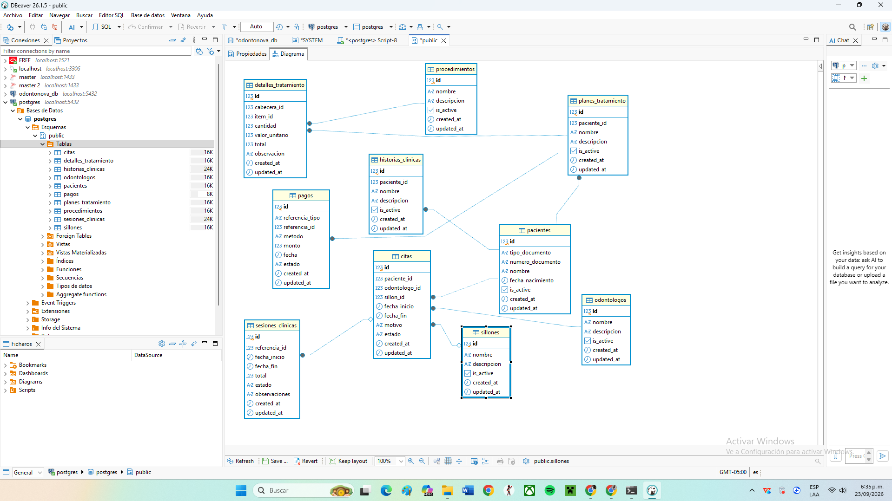

# 🐘 Migración de OdontoNova a PostgreSQL

Documentación y evidencias del proceso de migración del esquema de base de datos **OdontoNova** a **PostgreSQL** utilizando DBeaver y Docker.

---

## 📌 1. Scripts SQL

* **`schema.sql`**: Definición de la estructura de tablas (DDL) adaptada a PostgreSQL (`SERIAL`, `BOOLEAN`, `NUMERIC`, `TIMESTAMP`).
* **`data.sql`**: Inserción de datos de prueba (DML) para verificar la integridad relacional.

---

## 📸 2. Evidencias de Creación de Tablas (DDL)

### Tabla 1: Pacientes

### Tabla 2: Odontólogos

### Tabla 3: Sillones

### Tabla 4: Historias Clínicas

### Tabla 5: Citas

### Tabla 6: Planes de Tratamiento

### Tabla 7: Procedimientos

### Tabla 8: Detalles de Tratamiento

### Tabla 9: Sesiones Clínicas

### Tabla 10: Pagos

---

## 📊 3. Modelo Entidad-Relación (ERD)

Diagrama relacional completo de las 10 tablas interconectadas del proyecto en PostgreSQL:

