# Documentación del Sistema OdontoNova

Este documento contiene la estructura de inserción de datos para las 10 tablas del sistema y el compendio de las 19 consultas SQL utilizadas en PostgreSQL, acompañadas de sus respectivas evidencias visuales.

---

## 📁 1. Estructura de Tablas e Inserción de Datos

### Tabla 1: Pacientes

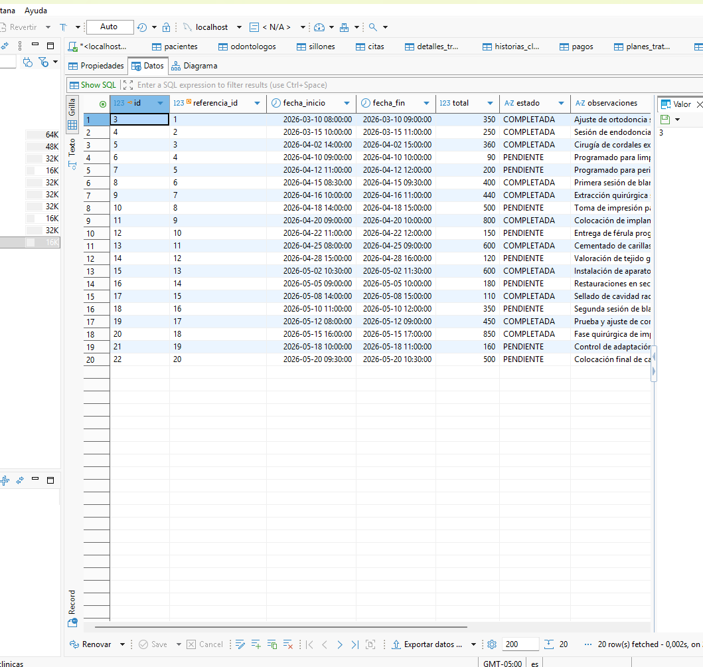

```sql
INSERT INTO pacientes (tipo_documento, numero_documento, nombre, fecha_nacimiento, is_active, created_at, updated_at) VALUES
('CC', '1001234567', 'Carlos Pérez', '1995-04-12', true, NOW(), NOW()),
('CC', '1001234568', 'María Rodríguez', '1992-08-22', true, NOW(), NOW()),
('TI', '1001234569', 'Juan Gómez', '2010-03-15', true, NOW(), NOW()),
('CC', '1001234570', 'Ana Martínez', '1988-11-05', true, NOW(), NOW()),
('CC', '1001234571', 'Luis Torres', '2001-07-19', false, NOW(), NOW()),
('TI', '1001234572', 'Sofía López', '2012-01-30', true, NOW(), NOW()),
('CC', '1001234573', 'Mateo Díaz', '1996-09-25', true, NOW(), NOW()),
('CC', '1001234574', 'Lucía Fernández', '1990-12-14', false, NOW(), NOW()),
('TI', '1001234575', 'David Ramírez', '2011-06-08', true, NOW(), NOW()),
('CC', '1001234576', 'Valeria Castro', '1999-02-19', true, NOW(), NOW());
```

### Tabla 2: Odontólogos

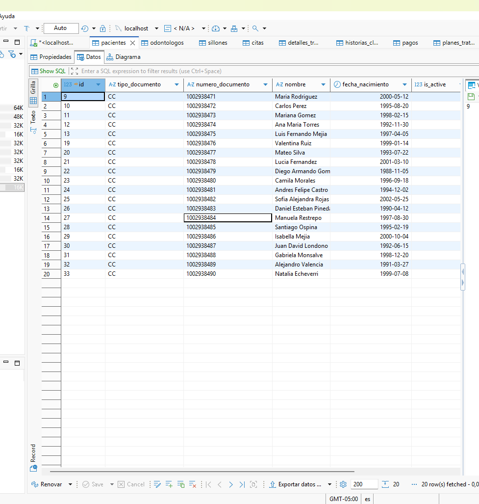

```sql
INSERT INTO odontologos (nombre, descripcion, is_active, created_at, updated_at) VALUES
('Dr. Alberto Vargas', 'Especialista en Ortodoncia y Ortopedia Maxilar', true, NOW(), NOW()),
('Dra. Carmen Jiménez', 'Especialista en Endodoncia avanzada', true, NOW(), NOW()),
('Dr. Roberto Mendoza', 'Periodoncista y cirujano periodontal', true, NOW(), NOW()),
('Dra. Elena Rojas', 'Cirujana Maxilofacial', true, NOW(), NOW()),
('Dr. Gabriel Silva', 'Odontopediatra infantil', true, NOW(), NOW()),
('Dra. Patricia Acosta', 'Rehabilitación Oral y Estética', true, NOW(), NOW()),
('Dr. Fernando Navarro', 'Ortodoncista clínico', true, NOW(), NOW()),
('Dra. Daniela Moreno', 'Especialista en diseño de sonrisa', true, NOW(), NOW()),
('Dr. Héctor Blanco', 'Implantólogo oral', true, NOW(), NOW()),
('Dra. Claudia Parra', 'Especialista en endodoncia y operatoria', true, NOW(), NOW());
```

### Tabla 3: Sillones

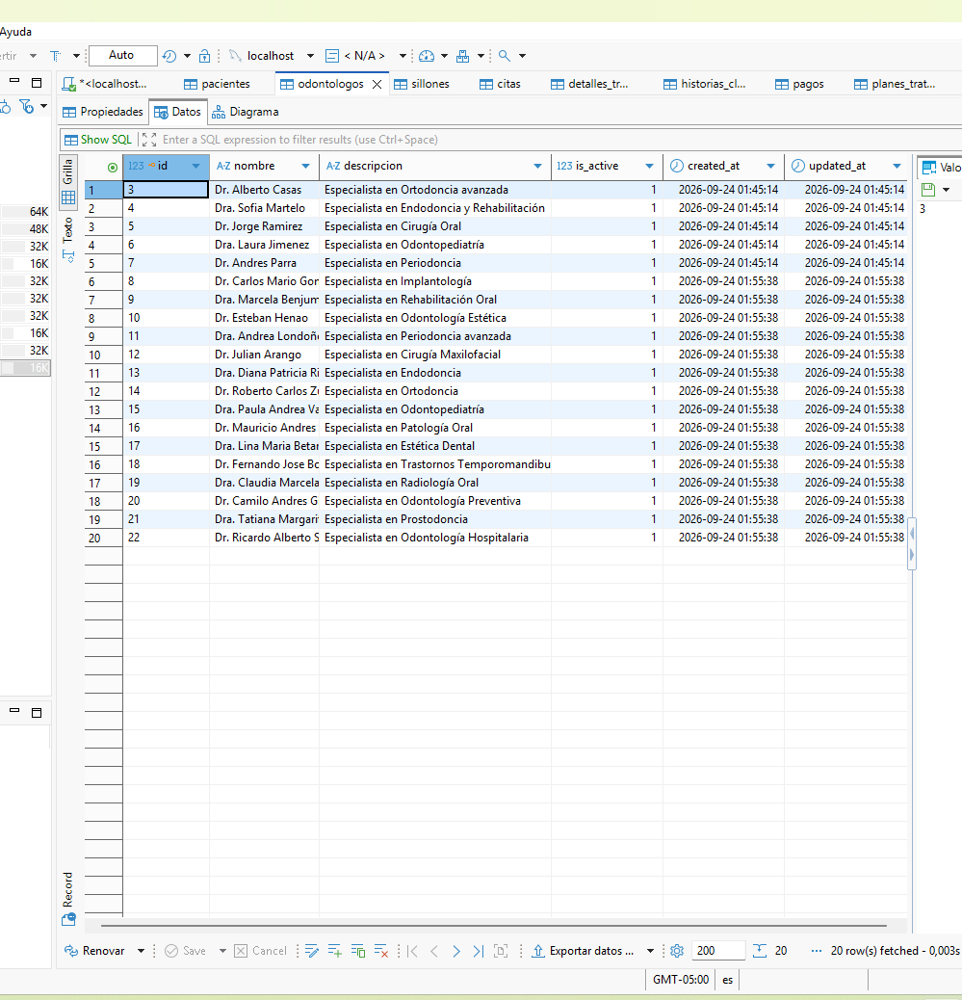

```sql
INSERT INTO sillones (nombre, descripcion, is_active, created_at, updated_at) VALUES
('Sillón 1', 'Unidad dental principal de ortodoncia - Piso 1', true, NOW(), NOW()),
('Sillón 2', 'Unidad de endodoncia y rayos X - Piso 1', true, NOW(), NOW()),
('Sillón 3', 'Unidad de periodoncia e higiene - Piso 1', true, NOW(), NOW()),
('Sillón 4', 'Unidad quirúrgica maxilofacial - Piso 2', true, NOW(), NOW()),
('Sillón 5', 'Unidad infantil adaptada - Piso 2', true, NOW(), NOW()),
('Sillón 6', 'Unidad de estética y blanqueamiento - Piso 2', true, NOW(), NOW()),
('Sillón 7', 'Unidad de revisión general - Piso 3', true, NOW(), NOW()),
('Sillón 8', 'Unidad de implantología - Piso 3', true, NOW(), NOW()),
('Sillón 9', 'Unidad de urgencias - Piso 3', true, NOW(), NOW()),
('Sillón 10', 'Unidad de post-operatorio - Piso 4', false, NOW(), NOW());
```

### Tabla 4: Citas

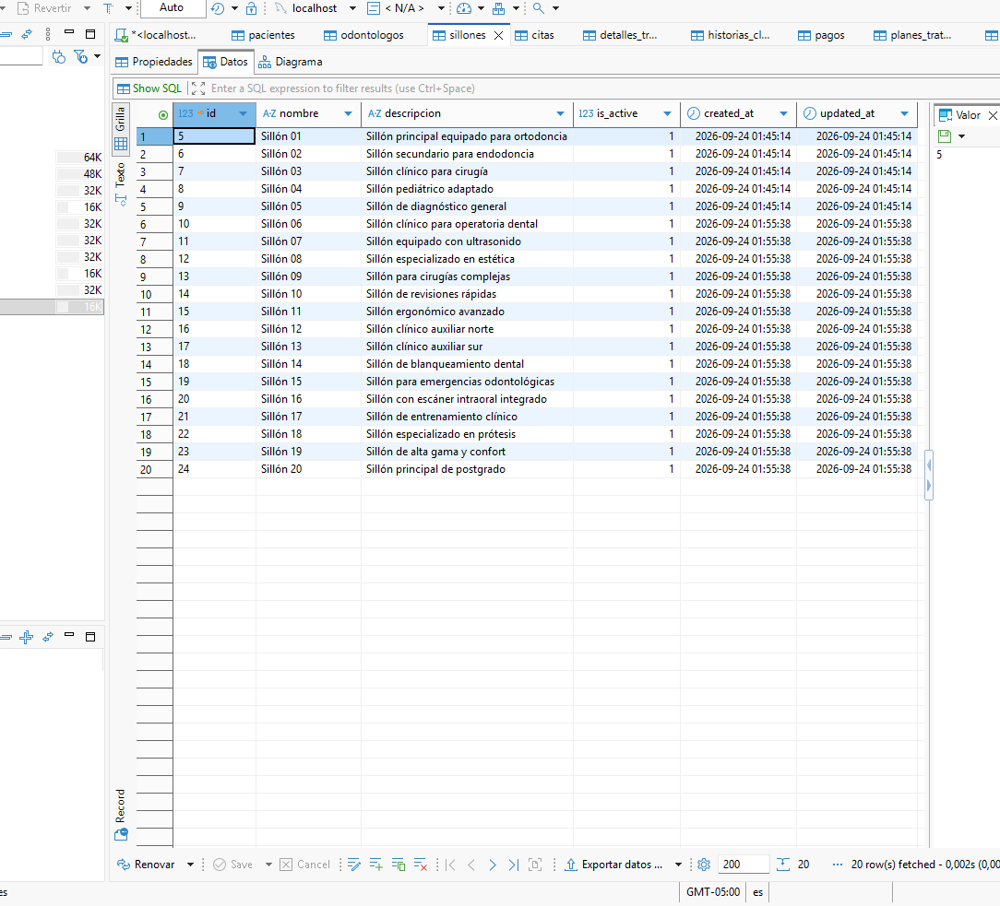

```sql
INSERT INTO citas (paciente_id, odontologo_id, sillon_id, fecha_inicio, fecha_fin, motivo, estado, created_at, updated_at) VALUES
(1, 1, 1, '2026-03-01 08:00:00', '2026-03-01 09:00:00', 'Control de ortodoncia', 'COMPLETADA', NOW(), NOW()),
(2, 2, 2, '2026-03-02 09:30:00', '2026-03-02 10:30:00', 'Dolor en muela del juicio', 'COMPLETADA', NOW(), NOW()),
(3, 3, 3, '2026-03-05 10:00:00', '2026-03-05 11:00:00', 'Limpieza y revisión general', 'COMPLETADA', NOW(), NOW()),
(4, 4, 4, '2026-03-10 14:00:00', '2026-03-10 15:30:00', 'Evaluación para cirugía', 'PENDIENTE', NOW(), NOW()),
(5, 5, 5, '2026-03-12 11:00:00', '2026-03-12 12:00:00', 'Revision dental infantil', 'CANCELADA', NOW(), NOW()),
(6, 6, 6, '2026-03-15 16:00:00', '2026-03-15 17:00:00', 'Instalación de prótesis', 'PENDIENTE', NOW(), NOW()),
(7, 1, 1, '2026-03-18 08:30:00', '2026-03-18 09:30:00', 'Ajuste de brackets', 'COMPLETADA', NOW(), NOW()),
(8, 7, 7, '2026-03-20 10:30:00', '2026-03-20 11:30:00', 'Blanqueamiento dental', 'COMPLETADA', NOW(), NOW()),
(9, 8, 8, '2026-03-22 15:00:00', '2026-03-22 16:00:00', 'Diseño de sonrisa', 'PENDIENTE', NOW(), NOW()),
(10, 2, 2, '2026-03-25 09:00:00', '2026-03-25 10:00:00', 'Tratamiento de conducto', 'COMPLETADA', NOW(), NOW());
```

### Tabla 5: Historias Clínicas

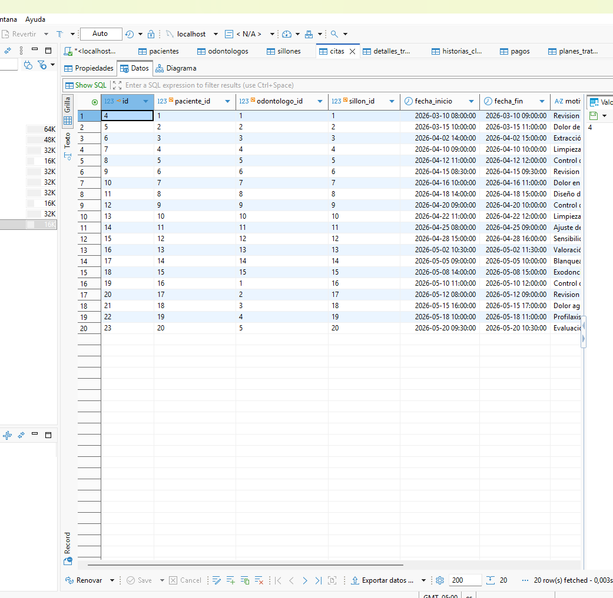

```sql
INSERT INTO historias_clinicas (paciente_id, nombre, descripcion, is_active, created_at, updated_at) VALUES
(1, 'Historia General - Carlos Pérez', 'Paciente con buena higiene general, portador de aparatología fija.', true, NOW(), NOW()),
(2, 'Historia General - María Rodríguez', 'Presenta sensibilidad dental al frío y calor moderados. Alérgica a penicilina.', true, NOW(), NOW()),
(3, 'Historia General - Juan Gómez', 'Encías sanas, sin presencia de caries activas recientes.', true, NOW(), NOW()),
(4, 'Historia General - Ana Martínez', 'Requiere valoración médica por antecedentes de sangrado.', true, NOW(), NOW()),
(5, 'Historia General - Sofía López', 'Paciente pediátrico en etapa de recambio dental.', true, NOW(), NOW()),
(6, 'Historia General - Luis Torres', 'Pérdida ósea leve en zona posterior inferior.', false, NOW(), NOW()),
(7, 'Historia General - Mateo Díaz', 'Evolución favorable en tratamiento de ortodoncia.', true, NOW(), NOW()),
(8, 'Historia General - Lucía Fernández', 'Esmalte resistente, apto para procedimientos estéticos.', false, NOW(), NOW()),
(9, 'Historia General - David Ramírez', 'Dientes apiñados levemente en arcada superior.', true, NOW(), NOW()),
(10, 'Historia General - Valeria Castro', 'Infección localizada tratada con éxito mediante conductos.', true, NOW(), NOW());
```

### Tabla 6: Planes de Tratamiento

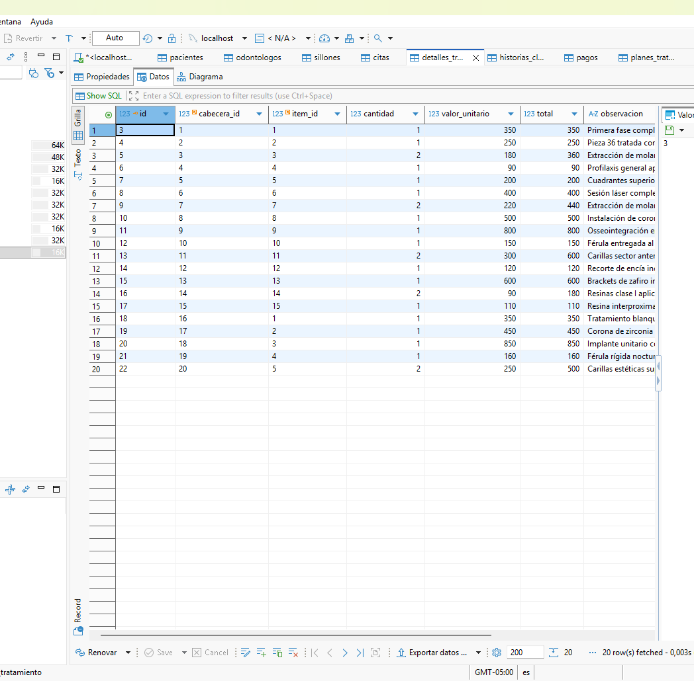

```sql
INSERT INTO planes_tratamiento (paciente_id, nombre, descripcion, is_active, created_at, updated_at) VALUES
(1, 'Plan Ortodoncia Avanzada', 'Instalación y controles periódicos de frenillos metálicos', true, NOW(), NOW()),
(2, 'Plan Endodoncia Molar', 'Tratamiento de conductos y reconstrucción con corona', true, NOW(), NOW()),
(3, 'Plan Profilaxis Preventiva', 'Limpieza profunda, aplicación de flúor y educación oral', true, NOW(), NOW()),
(4, 'Plan Cirugía Maxilofacial', 'Exodoncia compleja de cordales retenidas', true, NOW(), NOW()),
(5, 'Plan Odontopediatría Integral', 'Sellantes, profilaxis y control de caries infantil', true, NOW(), NOW()),
(6, 'Plan Rehabilitación Protésica', 'Colocación de prótesis removible superior', false, NOW(), NOW()),
(7, 'Plan Estética Láser', 'Blanqueamiento dental LED y pulido estético', true, NOW(), NOW()),
(8, 'Plan Implantología Unitaria', 'Fijación de implante de titanio y corona fija', true, NOW(), NOW()),
(9, 'Plan Periodoncia y Curetaje', 'Tratamiento periodontal para control de encías', true, NOW(), NOW()),
(10, 'Plan Restaurador Estético', 'Resinas compuestas en sector anterior', true, NOW(), NOW());
```

### Tabla 7: Procedimientos

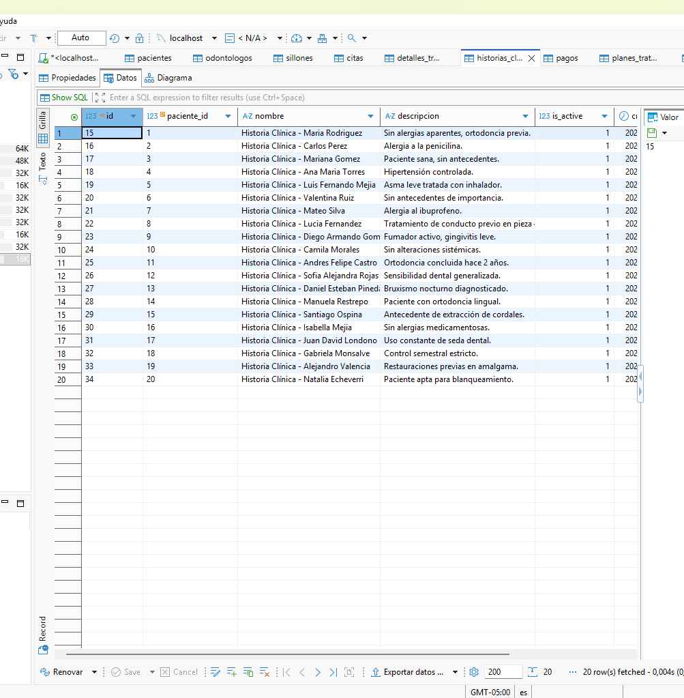

```sql
INSERT INTO procedimientos (nombre, descripcion, is_active, created_at, updated_at) VALUES
('Profilaxis Dental', 'Limpieza profunda y remoción de cálculo supragingival', true, NOW(), NOW()),
('Instalación de Brackets', 'Colocación inicial de aparatología ortodóntica', true, NOW(), NOW()),
('Tratamiento de Conducto', 'Endodoncia unirradicular o mular', true, NOW(), NOW()),
('Extracción Simple', 'Exodoncia de pieza dental deteriorada', true, NOW(), NOW()),
('Blanqueamiento LED', 'Clareamiento estético con luz halógena', true, NOW(), NOW()),
('Implante Dental', 'Inserción quirúrgica de tornillo de titanio', true, NOW(), NOW()),
('Resina Fotopolimerizable', 'Obturación estética por caries', true, NOW(), NOW()),
('Sellantes de Fosas y Fisuras', 'Prevención en molares jóvenes', true, NOW(), NOW()),
('Cirugía de Cordales', 'Extracción quirúrgica de muelas de juicio', true, NOW(), NOW()),
('Curetaje Periodontal', 'Limpieza profunda bajo encía', true, NOW(), NOW());
```

### Tabla 8: Detalles de Tratamiento

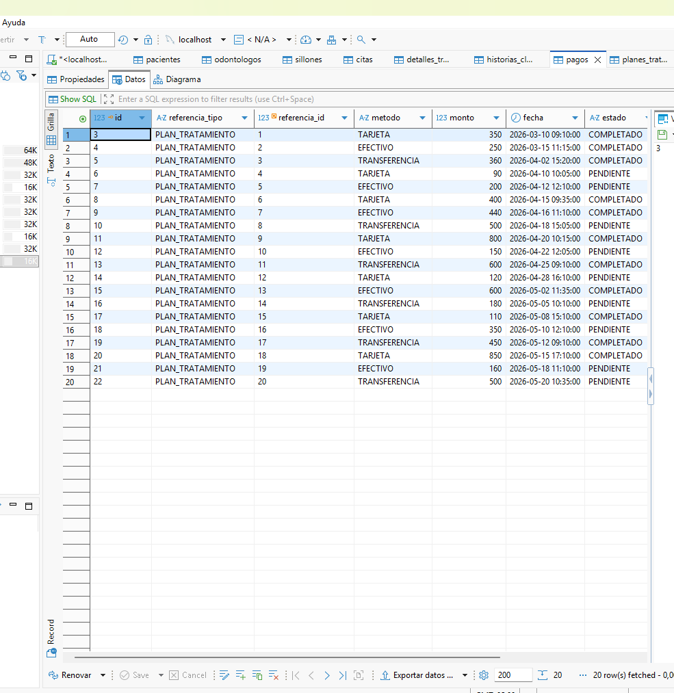

```sql
INSERT INTO detalles_tratamiento (cabecera_id, item_id, cantidad, valor_unitario, total, observacion, created_at, updated_at) VALUES
(1, 2, 1, 150000.00, 150000.00, 'Control mensual de ortodoncia', NOW(), NOW()),
(2, 3, 1, 200000.00, 200000.00, 'Apertura y medicación conducto', NOW(), NOW()),
(3, 1, 1, 80000.00, 80000.00, 'Profilaxis general', NOW(), NOW()),
(4, 9, 1, 500000.00, 500000.00, 'Cirugía maxilofacial programada', NOW(), NOW()),
(5, 8, 1, 60000.00, 60000.00, 'Aplicación de sellantes', NOW(), NOW()),
(6, 4, 1, 350000.00, 350000.00, 'Exodoncia simple múltiple', NOW(), NOW()),
(7, 2, 1, 150000.00, 150000.00, 'Ajuste de aparatología', NOW(), NOW()),
(8, 5, 1, 300000.00, 300000.00, 'Sesión de blanqueamiento láser', NOW(), NOW()),
(9, 7, 2, 300000.00, 600000.00, 'Resinas estéticas anteriores', NOW(), NOW()),
(10, 3, 1, 400000.00, 400000.00, 'Endodoncia molar definitiva', NOW(), NOW());
```

### Tabla 9: Sesiones Clínicas

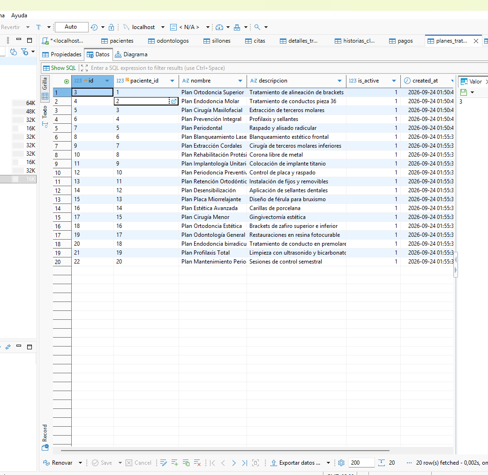

```sql
INSERT INTO sesiones_clinicas (referencia_id, fecha_inicio, fecha_fin, total, estado, observaciones, created_at, updated_at) VALUES
(1, '2026-03-01 08:00:00', '2026-03-01 09:00:00', 150000.00, 'COMPLETADA', 'Sesión de ortodoncia sin complicaciones.', NOW(), NOW()),
(2, '2026-03-02 09:30:00', '2026-03-02 10:30:00', 200000.00, 'COMPLETADA', 'Acceso cameral completado con éxito.', NOW(), NOW()),
(3, '2026-03-05 10:00:00', '2026-03-05 11:00:00', 80000.00, 'COMPLETADA', 'Profilaxis y pulido finalizado.', NOW(), NOW()),
(4, '2026-03-10 14:00:00', '2026-03-10 15:30:00', 500000.00, 'PROGRAMADA', 'Preparación para cirugía de cordales.', NOW(), NOW()),
(5, '2026-03-12 11:00:00', '2026-03-12 12:00:00', 60000.00, 'CANCELADA', 'Paciente no asistió por viaje.', NOW(), NOW()),
(6, '2026-03-15 16:00:00', '2026-03-15 17:00:00', 350000.00, 'PROGRAMADA', 'Toma de medidas para prótesis.', NOW(), NOW()),
(7, '2026-03-18 08:30:00', '2026-03-18 09:30:00', 150000.00, 'COMPLETADA', 'Cambio de arcos completado.', NOW(), NOW()),
(8, '2026-03-20 10:30:00', '2026-03-20 11:30:00', 300000.00, 'COMPLETADA', 'Blanqueamiento con excelente resultado estético.', NOW(), NOW()),
(9, '2026-03-22 15:00:00', '2026-03-22 16:00:00', 600000.00, 'PROGRAMADA', 'Mockup inicial de diseño de sonrisa.', NOW(), NOW()),
(10, '2026-03-25 09:00:00', '2026-03-25 10:00:00', 400000.00, 'COMPLETADA', 'Obturación de conductos radiculares.', NOW(), NOW());
```

### Tabla 10: Pagos

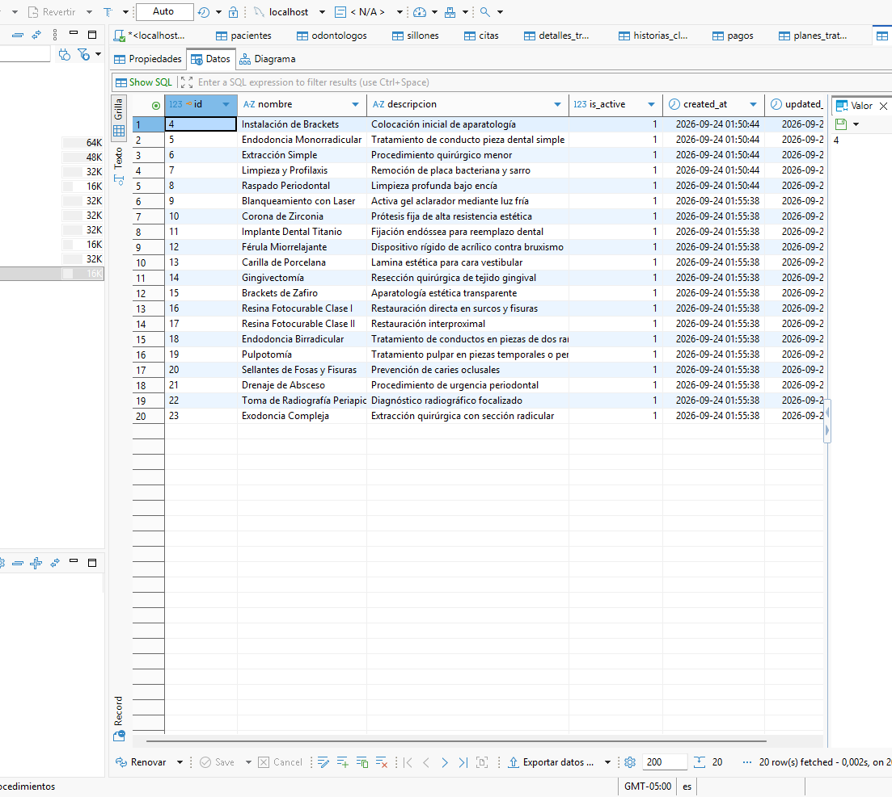

```sql
INSERT INTO pagos (referencia_tipo, referencia_id, metodo, monto, fecha, estado, created_at, updated_at) VALUES
('cita', 1, 'tarjeta', 150000.00, '2026-03-01 09:05:00', 'COMPLETADO', NOW(), NOW()),
('cita', 2, 'efectivo', 200000.00, '2026-03-02 10:35:00', 'COMPLETADO', NOW(), NOW()),
('cita', 3, 'transferencia', 80000.00, '2026-03-05 11:05:00', 'COMPLETADO', NOW(), NOW()),
('cita', 4, 'tarjeta', 500000.00, '2026-03-10 15:35:00', 'PENDIENTE', NOW(), NOW()),
('cita', 6, 'tarjeta', 350000.00, '2026-03-15 17:05:00', 'PENDIENTE', NOW(), NOW()),
('cita', 7, 'efectivo', 150000.00, '2026-03-18 09:35:00', 'COMPLETADO', NOW(), NOW()),
('cita', 8, 'transferencia', 300000.00, '2026-03-20 11:35:00', 'COMPLETADO', NOW(), NOW()),
('cita', 9, 'tarjeta', 600000.00, '2026-03-22 16:05:00', 'PENDIENTE', NOW(), NOW()),
('cita', 10, 'efectivo', 400000.00, '2026-03-25 10:05:00', 'COMPLETADO', NOW(), NOW()),
('cita', 1, 'transferencia', 50000.00, '2026-03-28 14:00:00', 'COMPLETADO', NOW(), NOW());
```

---

### 2. Consultas avanzadas en PostgreSQL : 

### Consulta 1: Listar todas las citas con nombres de pacientes y odontólogos

```sql
SELECT c.id AS cita_id, p.nombre AS paciente, o.nombre AS odontologo, s.nombre AS sillon, c.fecha_inicio, c.estado
FROM citas c JOIN pacientes p ON c.paciente_id = p.id JOIN odontologos o ON c.odontologo_id = o.id JOIN sillones s ON c.sillon_id = s.id;
```

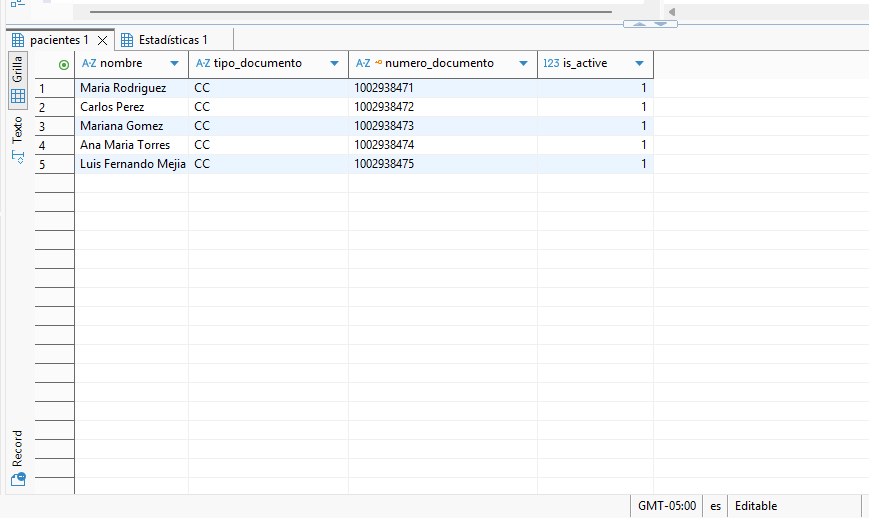

### Consulta 2: Ver historial clínico de un paciente específico

```sql
SELECT p.nombre AS paciente, p.numero_documento, h.nombre AS titulo_historia, h.descripcion AS detalle_medico, h.created_at
FROM historias_clinicas h JOIN pacientes p ON h.paciente_id = p.id WHERE p.id = 1;
```

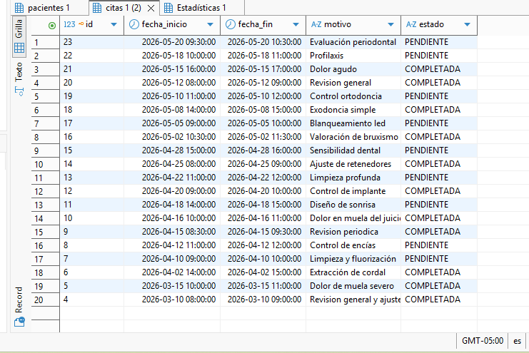

### Consulta 3: Consultar pagos con estado y fecha

```sql
SELECT pa.id AS pago_id, pa.referencia_tipo, pa.metodo, pa.monto, pa.estado, pa.fecha
FROM pagos pa ORDER BY pa.fecha DESC;
```

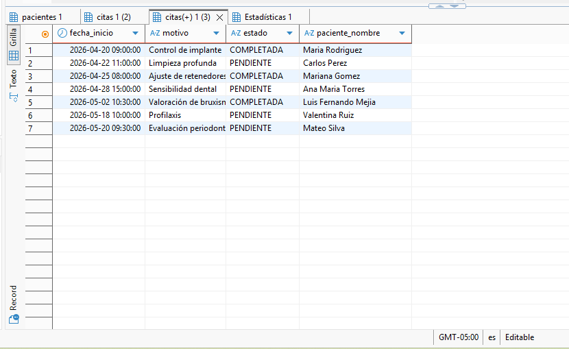

### Consulta 4: Detalles de tratamiento y procedimientos aplicados

```sql
SELECT dt.id AS detalle_id, pr.nombre AS procedimiento, dt.cantidad, dt.valor_unitario, dt.total, dt.observacion
FROM detalles_tratamiento dt JOIN procedimientos pr ON dt.item_id = pr.id;
```

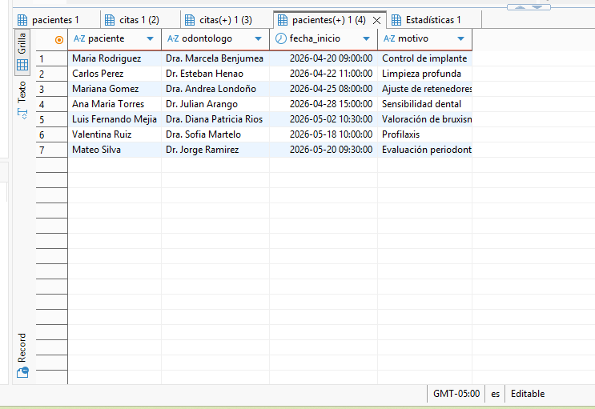

### Consulta 5: Resumen financiero de pagos completados

```sql
SELECT SUM(monto) AS total_recaudado, COUNT(*) AS cantidad_pagos_completados
FROM pagos WHERE estado = 'COMPLETADO';
```

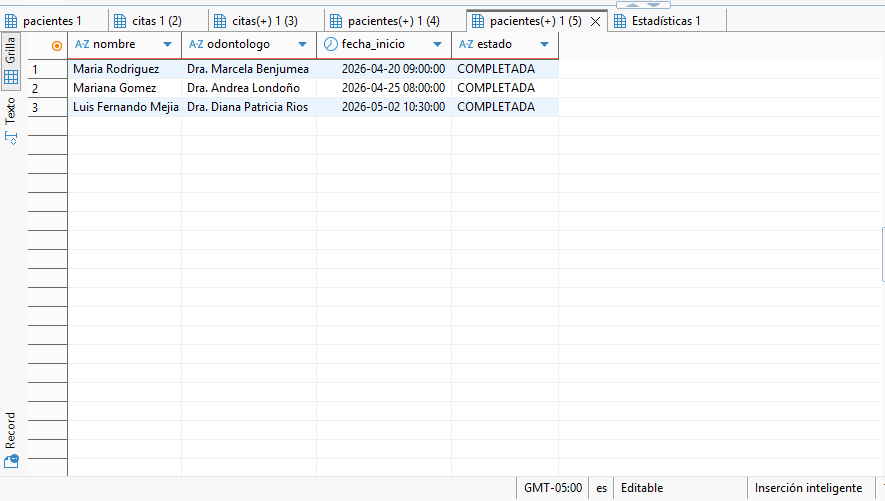

### Consulta 6: Planes de tratamiento activos por paciente

```sql
SELECT p.nombre AS paciente, pt.nombre AS plan_tratamiento, pt.descripcion, pt.is_active
FROM planes_tratamiento pt JOIN pacientes p ON pt.paciente_id = p.id WHERE pt.is_active = true;
```

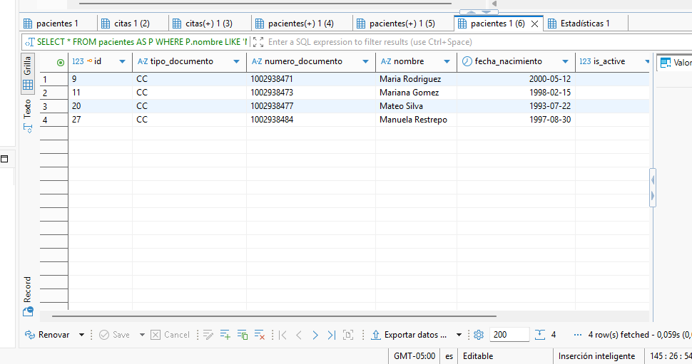

### Consulta 7: Odontólogos con citas programadas o pendientes

```sql
SELECT o.nombre AS odontologo, o.descripcion AS especialidad, c.fecha_inicio, c.estado
FROM odontologos o JOIN citas c ON o.id = c.odontologo_id WHERE c.estado != 'CANCELADA';
```

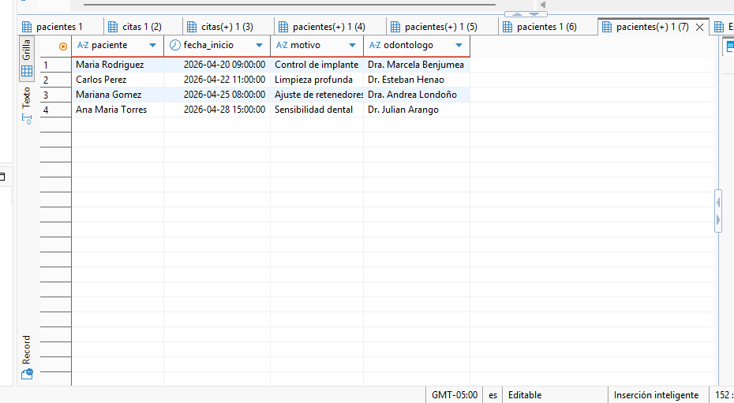

### Consulta 8: Sesiones clínicas y sus totales

```sql
SELECT id AS sesion_id, referencia_id, fecha_inicio, total, estado, observaciones
FROM sesiones_clinicas ORDER BY fecha_inicio ASC;
```

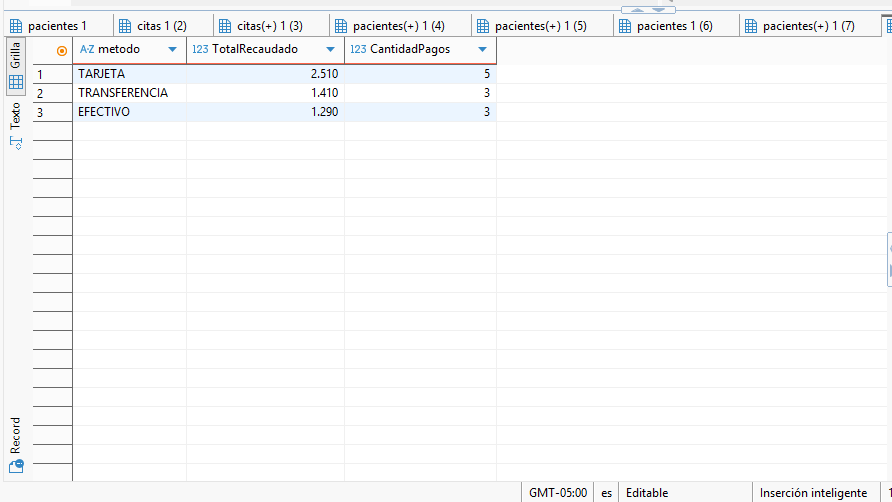

### Consulta 9: Sillones dentales activos

```sql
SELECT id AS sillon_id, nombre AS sillon, descripcion, is_active
FROM sillones WHERE is_active = true;
```

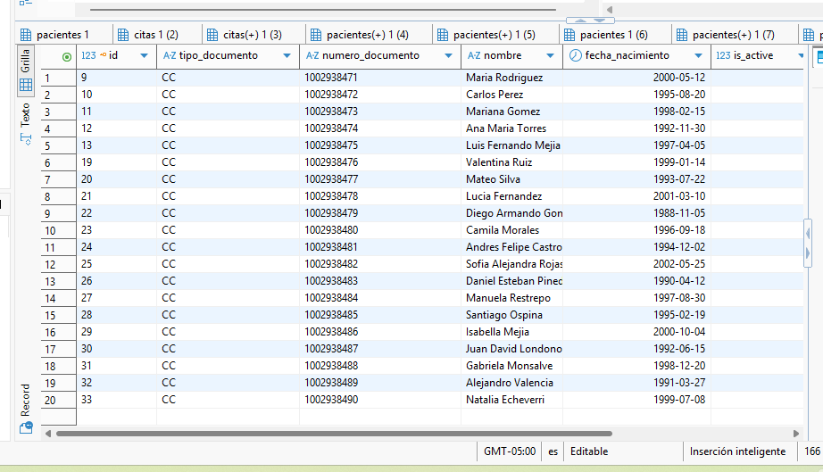

### Consulta 10: Búsqueda de pacientes por número de documento

```sql
SELECT id, tipo_documento, numero_documento, nombre, fecha_nacimiento, is_active
FROM pacientes WHERE numero_documento = '1001234567';
```

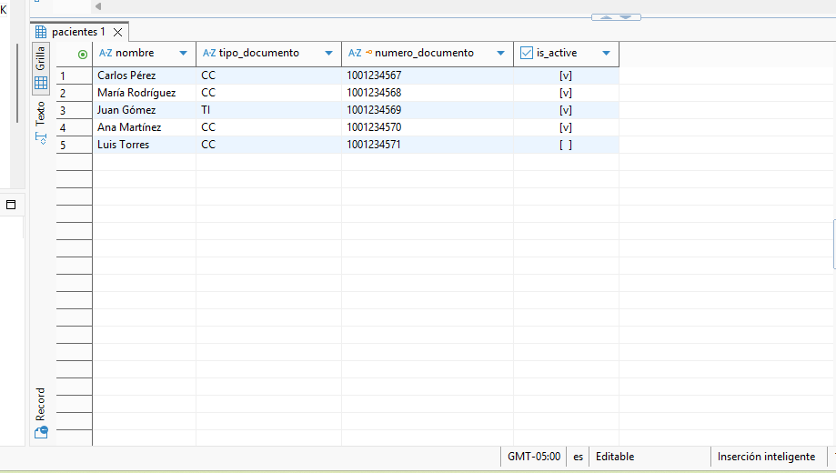

### Consulta 11: Odontólogos activos y sus especialidades

```sql
SELECT id, nombre, descripcion AS especialidad, is_active
FROM odontologos WHERE is_active = true;
```

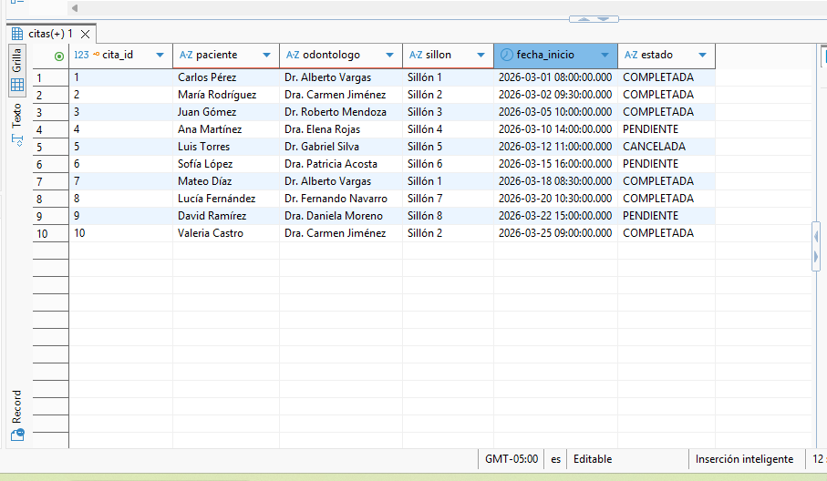

### Consulta 12: Citas canceladas

```sql
SELECT c.id, p.nombre AS paciente, o.nombre AS odontologo, c.fecha_inicio, c.motivo
FROM citas c JOIN pacientes p ON c.paciente_id = p.id JOIN odontologos o ON c.odontologo_id = o.id WHERE c.estado = 'CANCELADA';
```

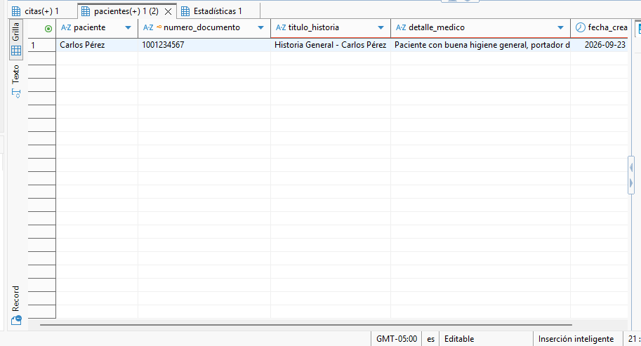

### Consulta 13: Procedimientos activos en catálogo

```sql
SELECT id, nombre, descripcion, is_active
FROM procedimientos WHERE is_active = true;
```

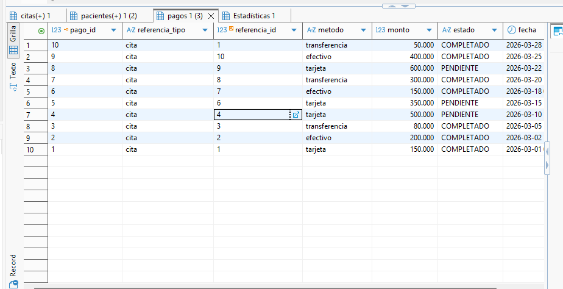

### Consulta 14: Total de citas registradas por paciente

```sql
SELECT p.nombre AS paciente, COUNT(c.id) AS total_citas
FROM pacientes p LEFT JOIN citas c ON p.id = c.paciente_id GROUP BY p.id, p.nombre;
```

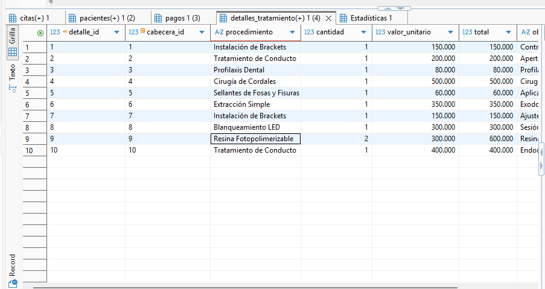

### Consulta 15: Total de dinero pendiente por cobro

```sql
SELECT SUM(monto) AS total_pendiente, COUNT(*) AS cantidad_pagos_pendientes
FROM pagos WHERE estado = 'PENDIENTE';
```

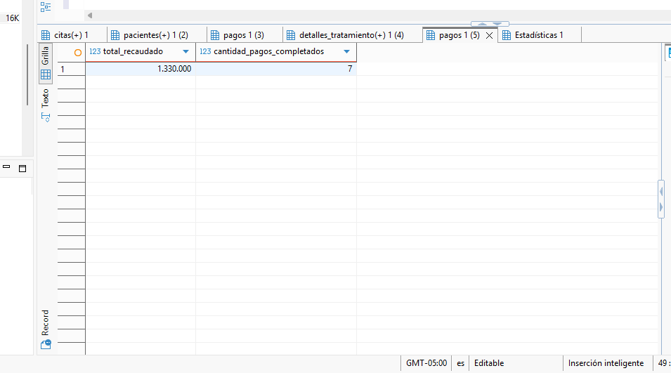

### Consulta 16: Historias clínicas activas

```sql
SELECT h.id, p.nombre AS paciente, h.nombre AS titulo, h.descripcion
FROM historias_clinicas h JOIN pacientes p ON h.paciente_id = p.id WHERE h.is_active = true;
```

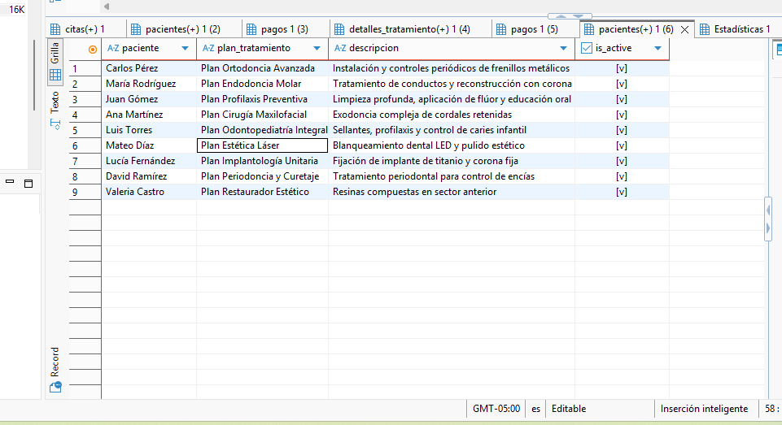

### Consulta 17: Detalles de tratamiento con costo mayor a 150,000

```sql
SELECT id, cabecera_id, cantidad, valor_unitario, total, observacion
FROM detalles_tratamiento WHERE total > 150000.00;
```

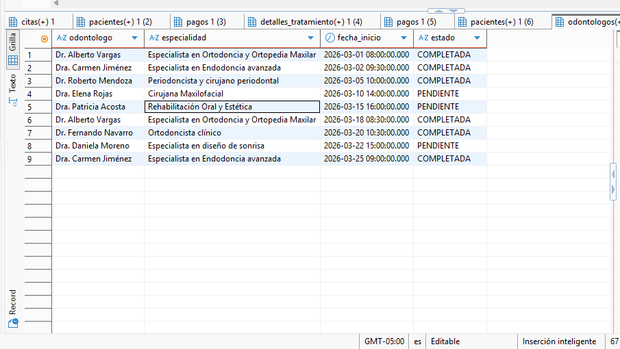

### Consulta 18: Pacientes ordenados por fecha de nacimiento

```sql
SELECT id, nombre, fecha_nacimiento, is_active
FROM pacientes ORDER BY fecha_nacimiento DESC;
```

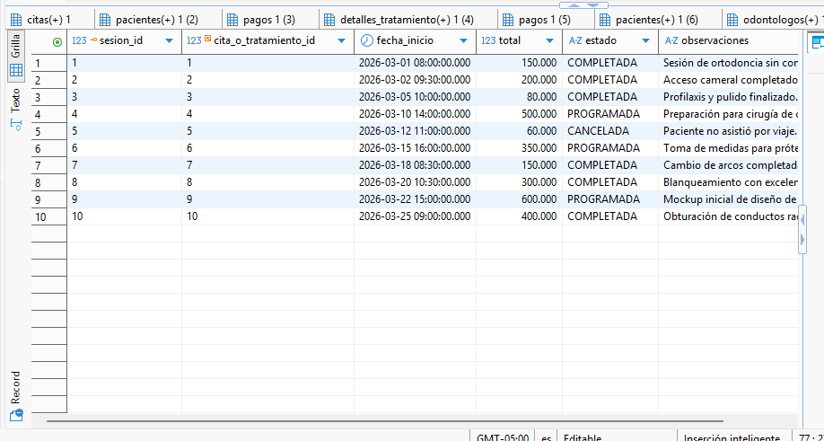

### Consulta 19: Sesiones clínicas completadas

```sql
SELECT id AS sesion_id, referencia_id, fecha_inicio, total, observaciones
FROM sesiones_clinicas WHERE estado = 'COMPLETADA';
```

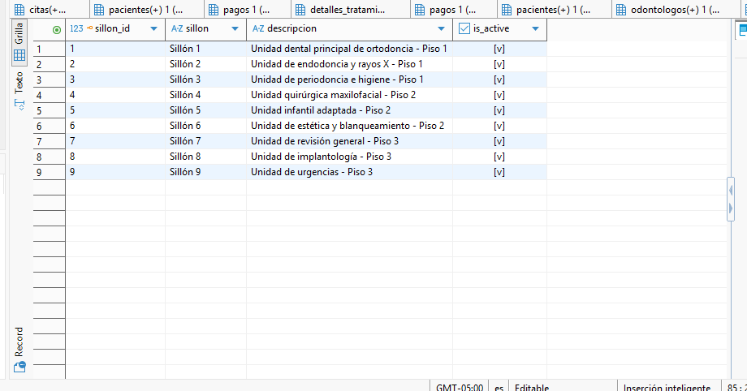

### Consulta 20: Citas con detalles de paciente y odontólogo

```sql
SELECT c.id AS cita_id, p.nombre AS paciente, o.nombre AS odontologo
FROM citas c 
JOIN pacientes p ON c.paciente_id = p.id 
JOIN odontologos o ON c.odontologo_id = o.id;
```

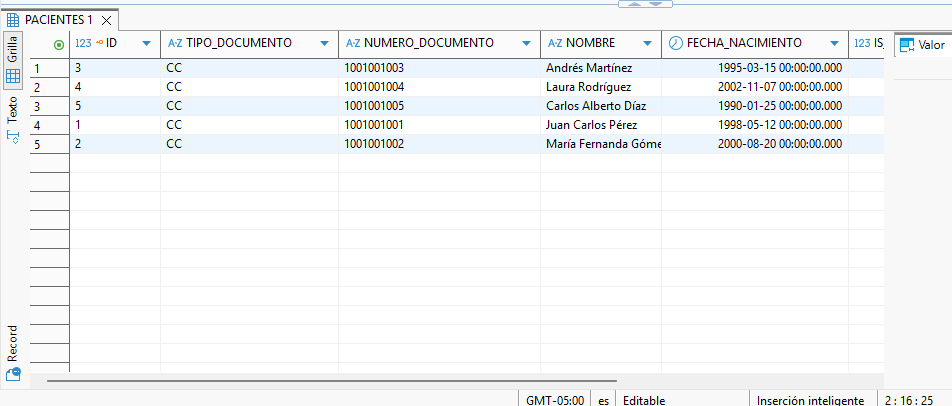

### Consulta 21: Pacientes filtrados por fecha de nacimiento (nacidos desde 2010)

```sql
SELECT nombre, numero_documento, fecha_nacimiento, is_active
FROM pacientes 
WHERE fecha_nacimiento >= '2010-01-01';
```

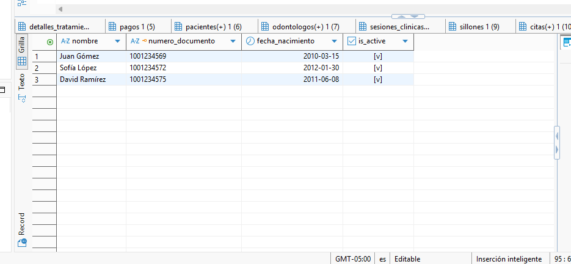

### Consulta 22: Registro y estado general de las citas

```sql
SELECT id, paciente_id, fecha_inicio, estado
FROM citas;
```


### Consulta 23: Conteo total de citas agrupadas por estado

```sql
SELECT estado, COUNT(id) AS total_citas
FROM citas 
GROUP BY estado;
```

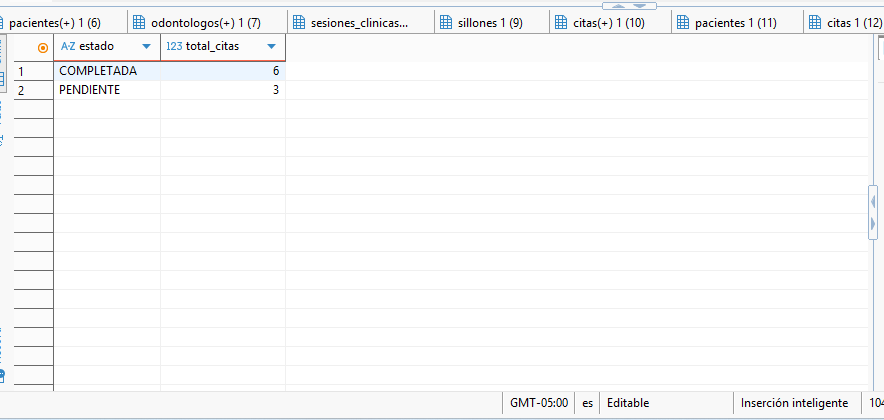

### Consulta 24: Búsqueda de odontólogos por patrón de texto (contienen la letra "a")

```sql
SELECT id, nombre
FROM odontologos
WHERE nombre ILIKE '%a%';
```

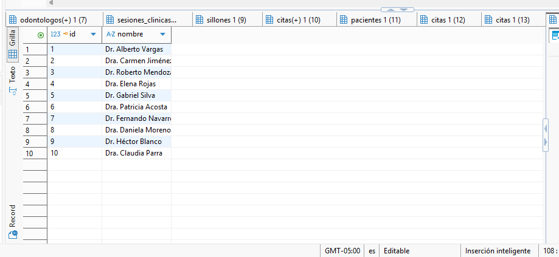

### Consulta 25: Búsqueda de pacientes inactivos

```sql
SELECT id, numero_documento, nombre
FROM pacientes
WHERE is_active = false;
```

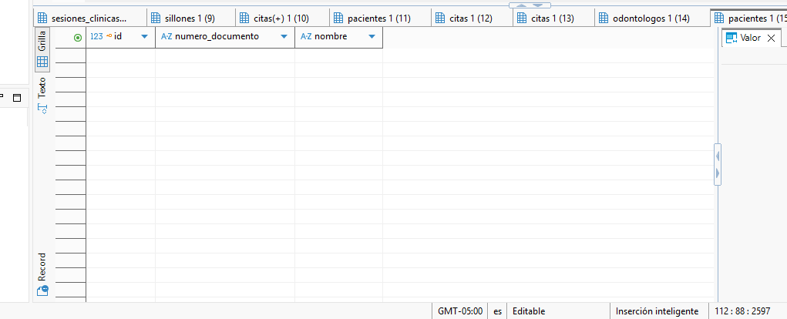

---

### 3. Consultas avanzadas en MySQL :

### Consulta 1: Mostrar registros de la tabla pacientes

```sql
SELECT nombre, tipo_documento, numero_documento, is_active FROM pacientes;
```

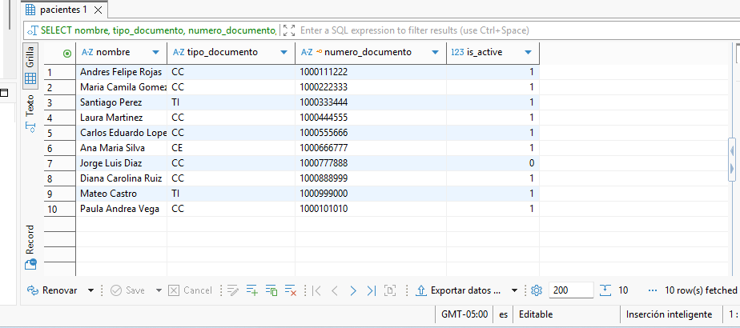

### Consulta 2: Consultas a múltiples tablas mediante WHERE

```sql
SELECT *
FROM citas c, pacientes p
WHERE p.id = c.paciente_id;
```

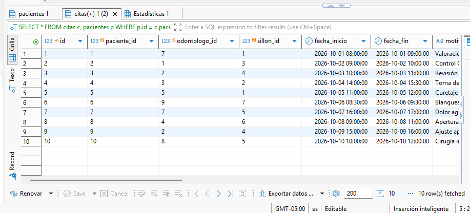

### Consulta 3: Condiciones o filtros en las consultas (WHERE implícito)

```sql
SELECT *
FROM citas c, pacientes p
WHERE p.id = c.paciente_id AND c.estado = 'programada';
```

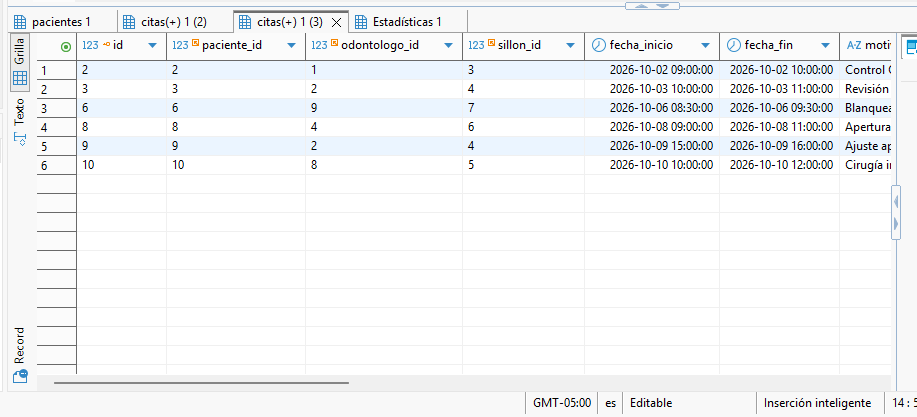

### Consulta 4: Mostrar de forma ordenada las citas (DESC)

```sql
SELECT id, fecha_inicio, estado
FROM citas
ORDER BY fecha_inicio DESC;
```

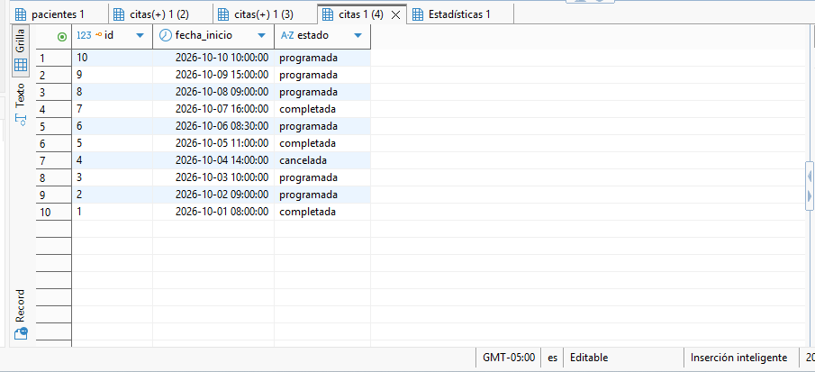

### Consulta 5: Consultas a múltiples tablas mediante JOIN (Básico)

```sql
SELECT P.nombre, P.numero_documento, C.*
FROM pacientes as P
JOIN citas as C on( P.id = C.paciente_id );
```

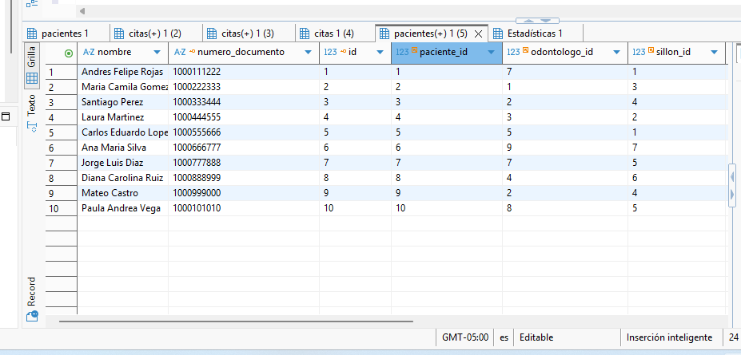

### Consulta 6: Consultas a múltiples tablas mediante JOIN (Con condición de estado)

```sql
SELECT P.nombre, P.numero_documento, C.*
FROM pacientes as P
JOIN citas as C on( P.id = C.paciente_id )
WHERE C.estado = 'completada';
```

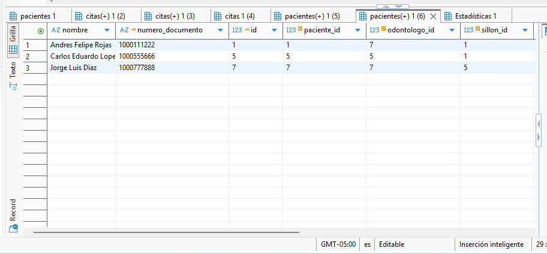

### Consulta 7: Consultas con filtro condicional LIKE (Empieza con 'M')

```sql
SELECT *
FROM pacientes as P
WHERE P.nombre LIKE 'm%';
```

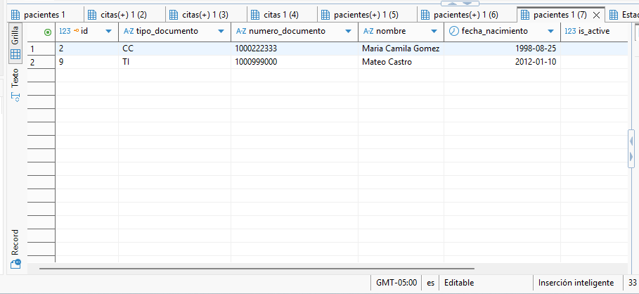

### Consulta 8: Consultas con filtro condicional LIKE (Contiene un nombre específico)

```sql
SELECT *
FROM pacientes as P
WHERE P.nombre LIKE CONCAT('%','maria','%');
```

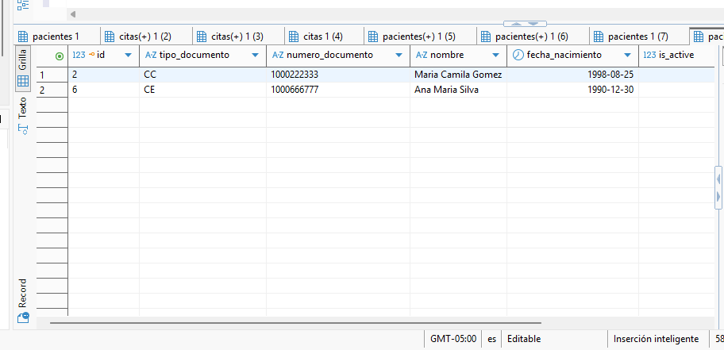

### Consulta 9: Combinación de WHERE y LIKE

```sql
SELECT P.nombre, P.numero_documento, C.*
FROM pacientes as P
JOIN citas as C on( P.id = C.paciente_id )
WHERE C.estado = 'programada' AND P.nombre LIKE 'm%';
```

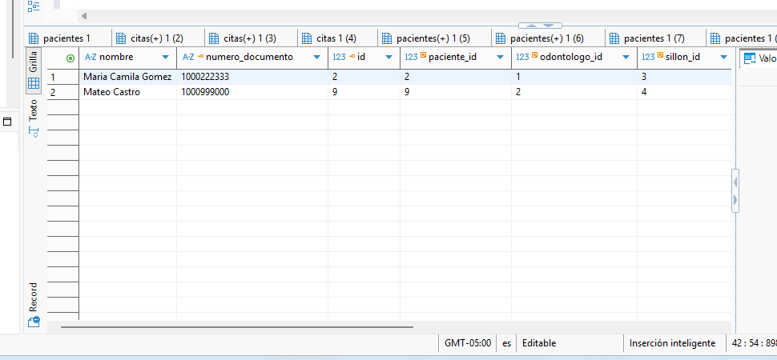

### Consulta 10: Consultas con filtros condicionales BETWEEN (Fechas de pago)

```sql
SELECT P.nombre, P.numero_documento, C.fecha_inicio, C.estado, PAG.fecha, O.nombre AS odontologo
FROM pacientes P
JOIN citas C ON P.id = C.paciente_id
JOIN pagos PAG ON C.id = PAG.referencia_id AND PAG.referencia_tipo = 'Cita'
JOIN odontologos O ON O.id = C.odontologo_id
WHERE PAG.fecha BETWEEN '2025-01-01 00:00:00' AND '2026-12-31 23:59:59'
ORDER BY PAG.fecha ASC;
```

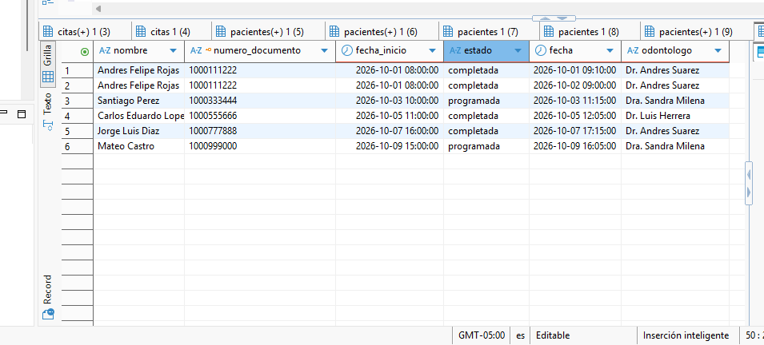

### Consulta 11: Consultas con filtros condicionales BETWEEN (Fechas de cita)

```sql
SELECT P.nombre, P.numero_documento, C.fecha_inicio, C.estado, PAG.fecha, O.nombre AS odontologo
FROM pacientes P, citas C, pagos PAG, odontologos O
WHERE P.id = C.paciente_id
  AND C.id = PAG.referencia_id
  AND PAG.referencia_tipo = 'Cita'
  AND O.id = C.odontologo_id
  AND C.fecha_inicio BETWEEN '2025-01-01' AND '2026-12-31'
ORDER BY PAG.fecha ASC;
```

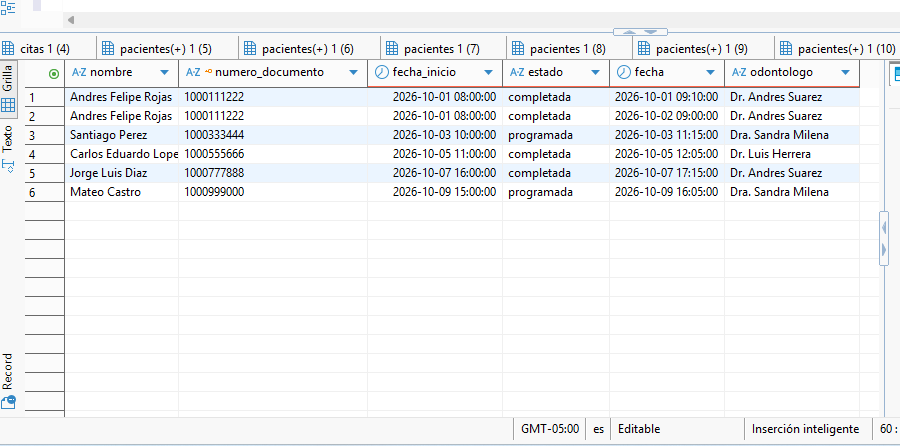

### Consulta 12: Consultas con agrupamiento GROUP BY (General)

```sql
SELECT P.id, P.nombre, SUM(PAG.monto) AS TotalSuma,
       COUNT(PAG.id) AS CuentaTotal,
       AVG(PAG.monto) AS Promedio
FROM pacientes AS P
JOIN citas AS C ON P.id = C.paciente_id
JOIN pagos AS PAG ON C.id = PAG.referencia_id AND PAG.referencia_tipo = 'Cita'
WHERE PAG.fecha BETWEEN '2025-01-01 00:00:00' AND '2026-12-31 23:59:59'
GROUP BY P.id, P.nombre
ORDER BY TotalSuma DESC;
```

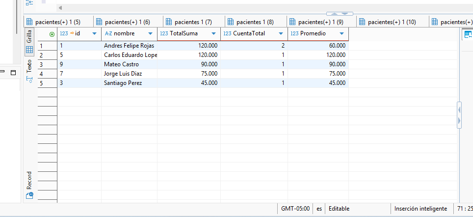

### Consulta 13: Consultas con agrupamiento GROUP BY (Filtrando por método)

```sql
SELECT P.id, P.nombre, SUM(PAG.monto) AS TotalGasto,
       COUNT(PAG.id) AS CantidadPagos
FROM pacientes AS P
JOIN citas AS C ON P.id = C.paciente_id
JOIN pagos AS PAG ON C.id = PAG.referencia_id AND PAG.referencia_tipo = 'Cita'
WHERE PAG.estado = 'pagado' AND PAG.metodo = 'tarjeta'
GROUP BY P.id, P.nombre
ORDER BY TotalGasto DESC;
```

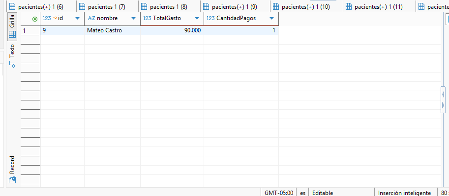

### Consulta 14: Consultas con agrupamiento HAVING (Suma de pagos)

```sql
SELECT P.id, P.nombre, SUM(PAG.monto) AS TotalSuma,
       AVG(PAG.monto) AS PromedioPago
FROM pacientes AS P
JOIN citas AS C ON P.id = C.paciente_id
JOIN pagos AS PAG ON C.id = PAG.referencia_id AND PAG.referencia_tipo = 'Cita'
GROUP BY P.id, P.nombre
HAVING SUM(PAG.monto) >= 50000
ORDER BY TotalSuma DESC;
```

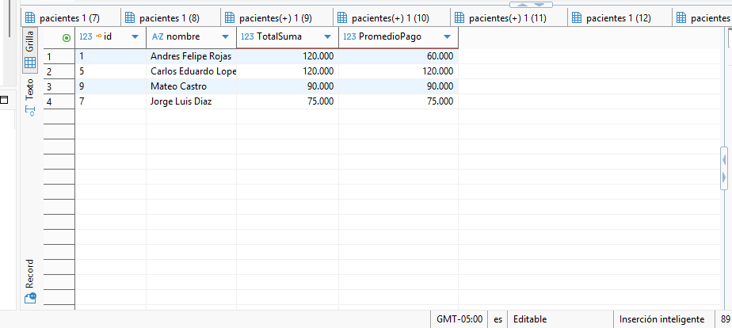

### Consulta 15: Consultas con agrupamiento HAVING (Combinado)

```sql
SELECT P.id, P.nombre, P.numero_documento, SUM(PAG.monto) AS TotalAnual,
       COUNT(PAG.id) AS TotalPagos
FROM pacientes AS P
JOIN citas AS C ON P.id = C.paciente_id
JOIN pagos AS PAG ON C.id = PAG.referencia_id AND PAG.referencia_tipo = 'Cita'
WHERE PAG.fecha BETWEEN '2025-01-01 00:00:00' AND '2026-12-31 23:59:59'
GROUP BY P.id, P.nombre, P.numero_documento
HAVING COUNT(PAG.id) >= 1 AND SUM(PAG.monto) >= 50000
ORDER BY TotalAnual DESC;
```

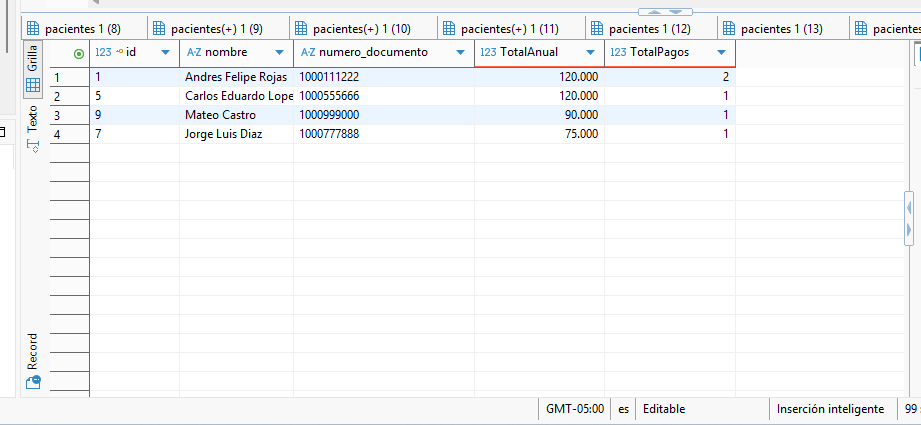

### Consulta 16: Subconsultas y teoría de conjuntos (Con NOT IN)

```sql
SELECT *
FROM pacientes as P
WHERE P.id NOT IN (
    SELECT C.paciente_id
    FROM citas as C
    WHERE C.fecha_inicio BETWEEN '2025-01-01' AND '2026-12-31'
);
```

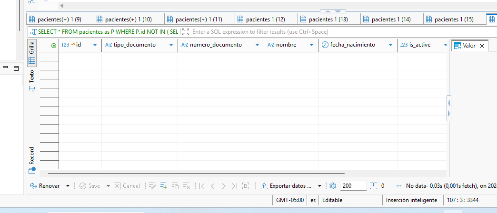

### Consulta 17: Subconsultas y teoría de conjuntos (Con LEFT JOIN)

```sql
SELECT *
FROM pacientes as P
LEFT JOIN citas as C ON(P.id = C.paciente_id AND C.fecha_inicio BETWEEN '2025-01-01' AND '2026-12-31')
WHERE C.paciente_id IS NULL;
```

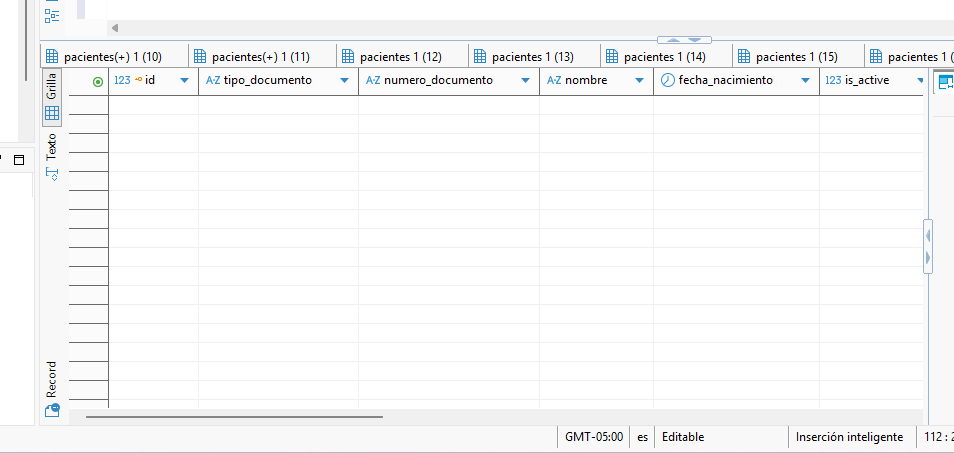

---

### 4. Consultas avanzadas en MSSQL :

### Consulta 1: Consultar pacientes

```sql
SELECT * FROM paciente;
```

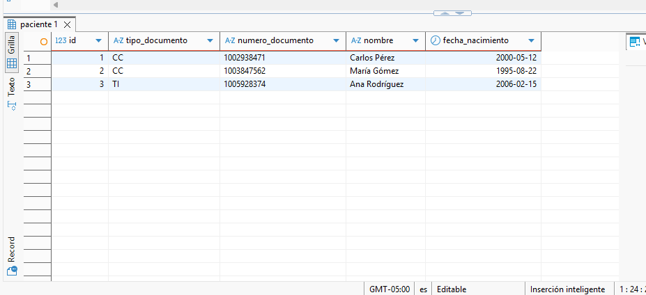

### Consulta 2: Consultar historias clínicas

```sql
SELECT * FROM historia_clinica;
```

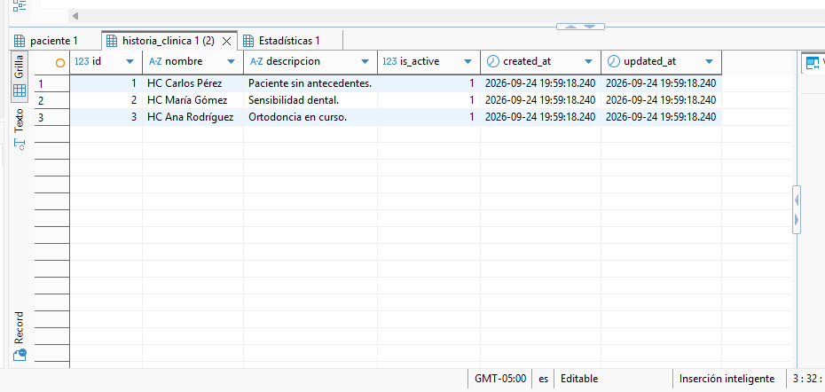

### Consulta 3: Consultar odontólogos

```sql
SELECT * FROM odontologo;
```

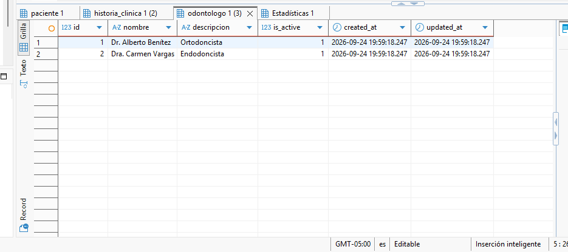

### Consulta 4: Consultar sillones

```sql
SELECT * FROM sillon;
```

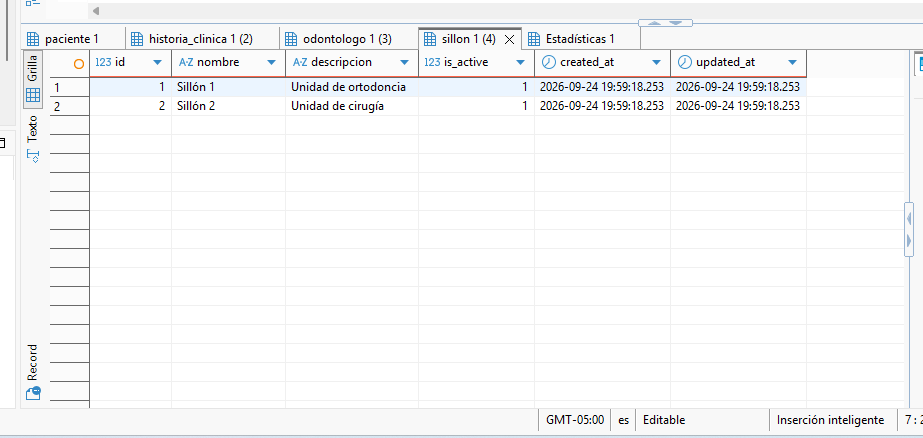

### Consulta 5: Consultar citas con información detallada (JOIN)

```sql
SELECT 
    c.id AS id_cita,
    p.nombre AS paciente,
    o.nombre AS odontologo,
    s.nombre AS sillon,
    c.fecha_inicio,
    c.fecha_fin,
    c.motivo,
    c.estado
FROM cita c
JOIN paciente p ON c.id_paciente = p.id
JOIN odontologo o ON c.id_odontologo = o.id
JOIN sillon s ON c.id_sillon = s.id;
```

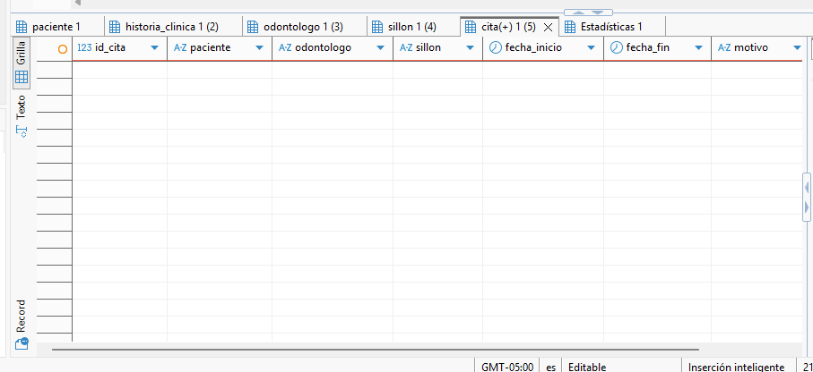

### Consulta 6: Consultar planes de tratamiento por paciente

```sql
SELECT 
    pt.id AS id_plan,
    p.nombre AS paciente,
    pt.nombre AS nombre_plan,
    pt.descripcion,
    pt.is_active
FROM plan_tratamiento pt
JOIN paciente p ON pt.id_paciente = p.id;
```

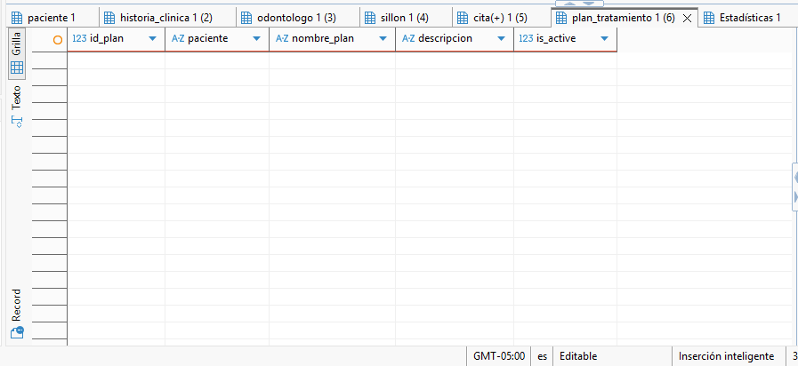

### Consulta 7: Consultar procedimientos disponibles

```sql
SELECT * FROM procedimiento;
```

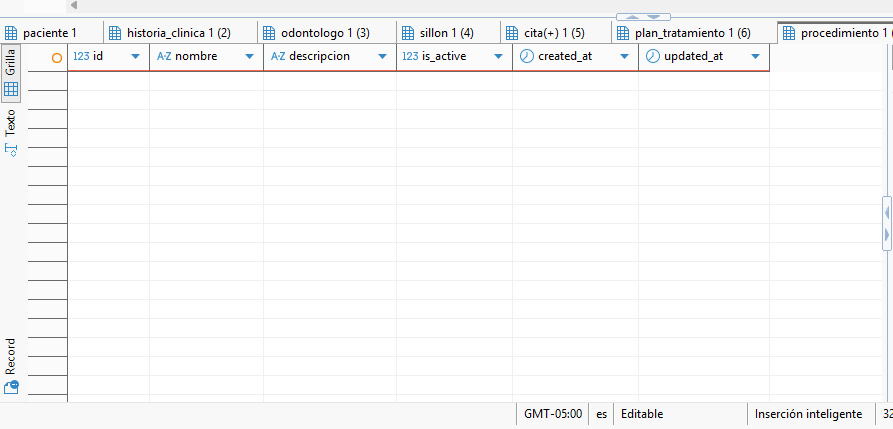

### Consulta 8: Consultar detalles de tratamiento

```sql
SELECT 
    dt.id,
    pt.nombre AS plan_tratamiento,
    pr.nombre AS procedimiento,
    dt.cantidad,
    dt.valor_unitario,
    dt.total,
    dt.observaciones
FROM detalle_tratamiento dt
JOIN plan_tratamiento pt ON dt.cabecera_id = pt.id
JOIN procedimiento pr ON dt.item_id = pr.id;
```

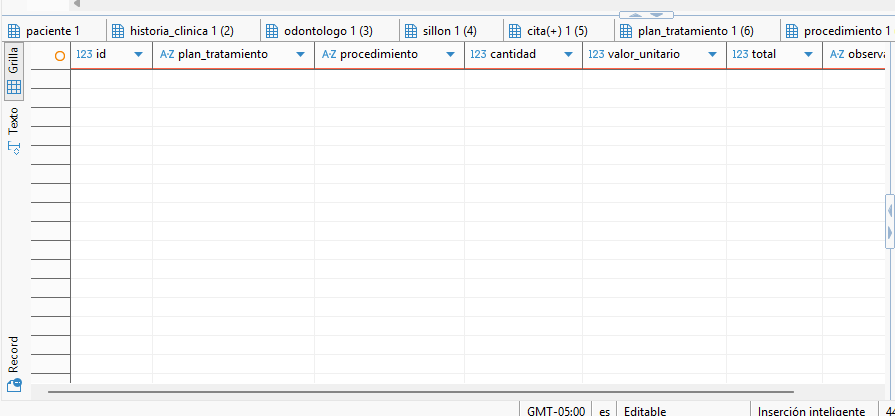

### Consulta 9: Consultar sesiones clínicas vinculadas a citas

```sql
SELECT 
    sc.id AS id_sesion,
    sc.referencia_id AS id_cita,
    p.nombre AS paciente,
    sc.fecha_inicio,
    sc.fecha_fin,
    sc.total,
    sc.estado,
    sc.observaciones
FROM sesion_clinica sc
JOIN cita c ON sc.referencia_id = c.id
JOIN paciente p ON c.id_paciente = p.id;
```

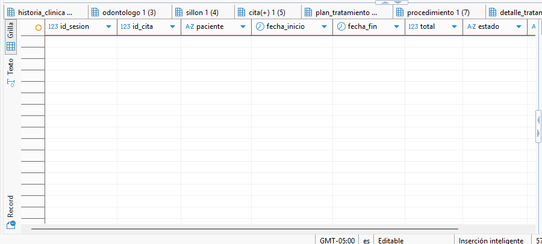

### Consulta 10: Consultar pagos realizados

```sql
SELECT 
    pg.id AS id_pago,
    pg.referencia_tipo,
    pt.nombre AS plan_asociado,
    p.nombre AS paciente,
    pg.metodo,
    pg.monto,
    pg.fecha,
    pg.estado
FROM pago pg
JOIN plan_tratamiento pt ON pg.referencia_id = pt.id
JOIN paciente p ON pt.id_paciente = p.id;
```

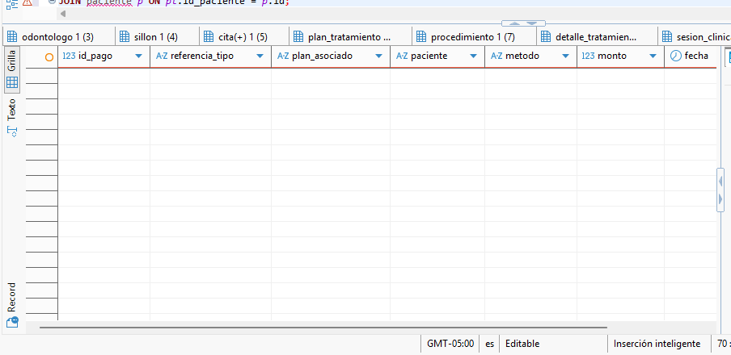

---

### 5. Consultas avanzadas en Oracle :

### Consulta 1: Consultar pacientes

```sql
SELECT *
FROM PACIENTES;
```


### Consulta 2: Consultar odontólogos

```sql
SELECT NOMBRE, ESPECIALIDAD, TELEFONO, EMAIL
FROM ODONTOLOGOS;
```

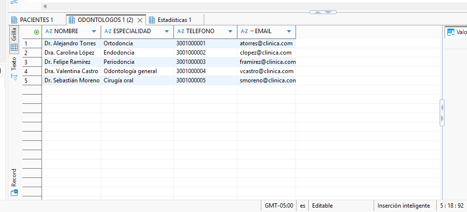

### Consulta 3: Consultar tratamientos ordenados por precio

```sql
SELECT NOMBRE, DESCRIPCION, PRECIO
FROM TRATAMIENTOS
ORDER BY PRECIO DESC;
```

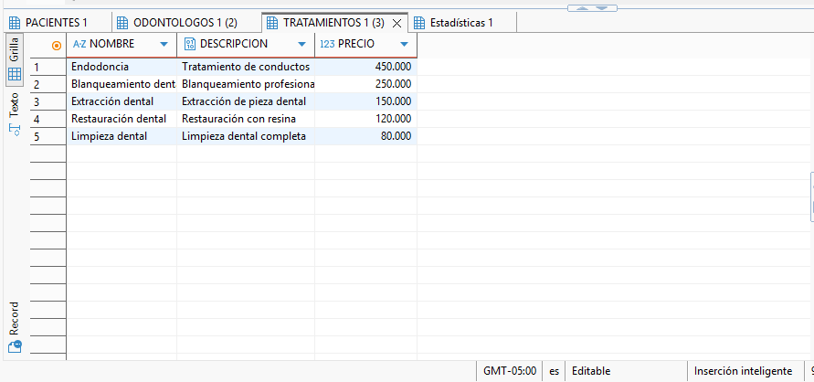

### Consulta 4: Consultar citas con paciente y odontólogo (JOIN)

```sql
SELECT
    C.ID,
    P.NOMBRE AS PACIENTE,
    O.NOMBRE AS ODONTOLOGO,
    C.FECHA_INICIO,
    C.FECHA_FIN,
    C.MOTIVO,
    C.ESTADO
FROM CITAS C
INNER JOIN PACIENTES P
    ON C.PACIENTE_ID = P.ID
INNER JOIN ODONTOLOGOS O
    ON C.ODONTOLOGO_ID = O.ID;
```

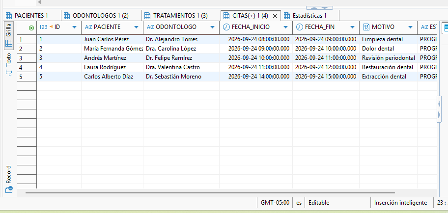

### Consulta 5: Consultar pagos con estado 'PAGADO' ordenados por monto

```sql
SELECT
    P.ID,
    P.REFERENCIA_TIPO,
    P.REFERENCIA_ID,
    P.METODO,
    P.MONTO,
    P.FECHA,
    P.ESTADO
FROM PAGOS P
WHERE P.ESTADO = 'PAGADO'
ORDER BY P.MONTO DESC;
```

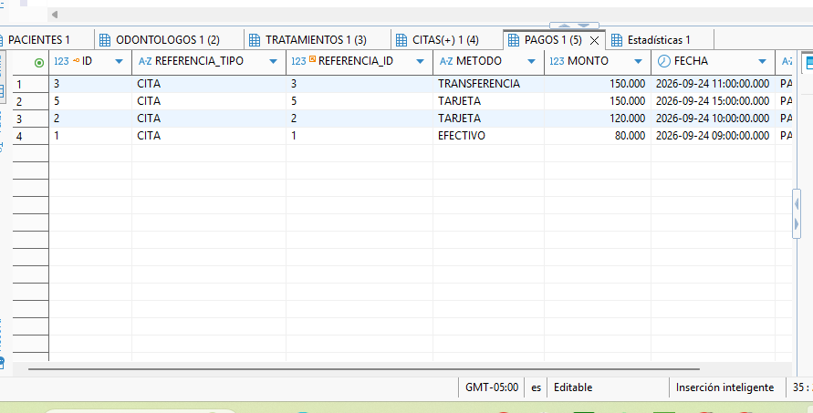

## CONCLUSIÓN

Con este proyecto entendí que trabajar con bases de datos va mucho más allá de escribir consultas sueltas, lo importante fue aprender a modelar el negocio de una clínica odontológica en tablas relacionadas y a moverme entre distintos motores (MySQL, SQL Server y Oracle) sin perder la lógica del problema. Resolver cosas como listar citas con su paciente y odontólogo, calcular totales de pagos por paciente o encontrar pacientes sin citas me mostró que un mismo requerimiento se puede lograr de varias maneras —con joins, agrupaciones, subconsultas o condiciones anidadas—, y que elegir la más clara y eficiente es parte del oficio.
