### Evidencias de Ejecucion: Procedimientos Almacenados en Postgre

### Consulta 1: Citas completas

```sql
CREATE OR REPLACE FUNCTION sp_pg_q1_citas_completas()
RETURNS TABLE (id_cita INT, paciente VARCHAR, odontologo VARCHAR, sillon VARCHAR, fecha_hora TIMESTAMP, motivo VARCHAR, estado VARCHAR) AS $$ 
BEGIN 
    RETURN QUERY 
    SELECT c.id_cita, (p.nombre || ' ' || p.apellido)::VARCHAR, (o.nombre || ' ' || o.apellido)::VARCHAR, s.numero_sillon::VARCHAR, c.fecha_hora, c.motivo::VARCHAR, c.estado::VARCHAR 
    FROM citas c 
    INNER JOIN pacientes p ON c.id_paciente = p.id_paciente 
    INNER JOIN odontologos o ON c.id_odontologo = o.id_odontologo 
    INNER JOIN sillones s ON c.id_sillon = s.id_sillon 
    WHERE c.estado = 'completada'; 
END; $$ LANGUAGE plpgsql;

SELECT * FROM sp_pg_q1_citas_completas();
```

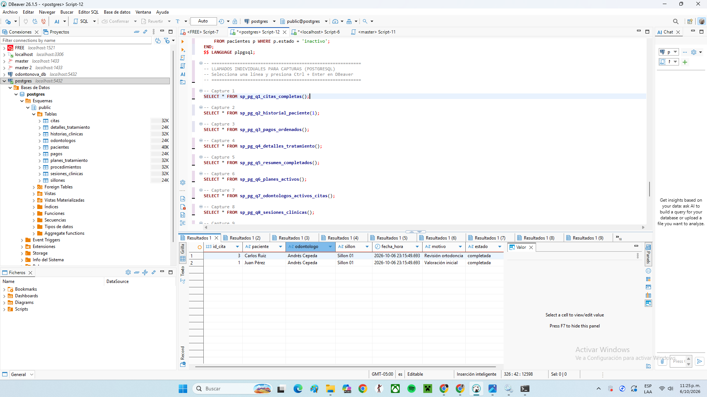

### Consulta 2: Ver historial clínico de un paciente específico

```sql
CREATE OR REPLACE FUNCTION sp_pg_q2_historial_paciente(p_id INT)
RETURNS TABLE (id_historia INT, paciente VARCHAR, antecedentes VARCHAR, diagnostico VARCHAR, fecha_creacion DATE) AS $$ 
BEGIN 
    RETURN QUERY 
    SELECT h.id_historia, (p.nombre || ' ' || p.apellido)::VARCHAR, h.antecedentes::VARCHAR, h.diagnostico::VARCHAR, h.fecha_creacion 
    FROM historias_clinicas h 
    INNER JOIN pacientes p ON h.id_paciente = p.id_paciente 
    WHERE h.id_paciente = p_id; 
END; $$ LANGUAGE plpgsql;

SELECT * FROM sp_pg_q2_historial_paciente(1);
```

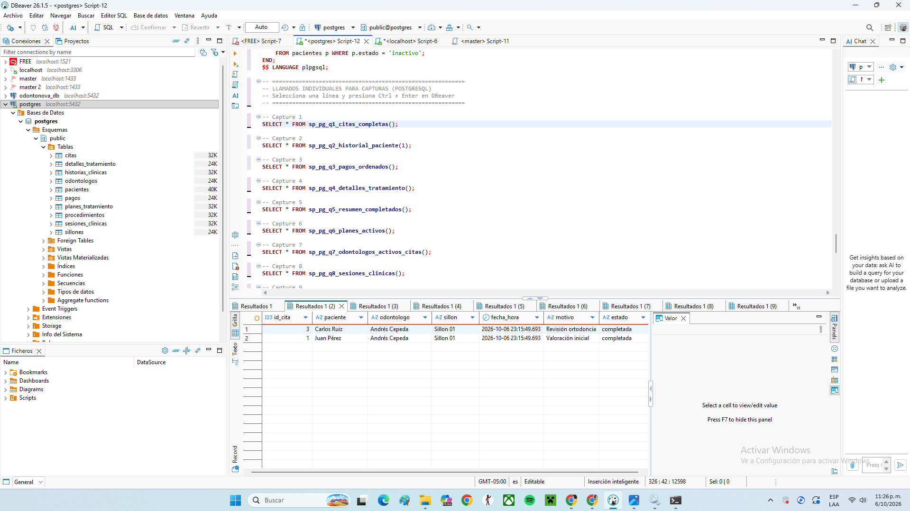

### Consulta 3: Consultar pagos ordenados por monto

```sql
CREATE OR REPLACE FUNCTION sp_pg_q3_pagos_ordenados()
RETURNS TABLE (id_pago INT, id_cita INT, monto NUMERIC, fecha_pago DATE, metodo_pago VARCHAR, estado VARCHAR) AS $$ 
BEGIN 
    RETURN QUERY 
    SELECT p.id_pago, p.id_cita, p.monto, p.fecha_pago, p.metodo_pago::VARCHAR, p.estado::VARCHAR 
    FROM pagos p ORDER BY p.monto DESC; 
END; $$ LANGUAGE plpgsql;

SELECT * FROM sp_pg_q3_pagos_ordenados();
```

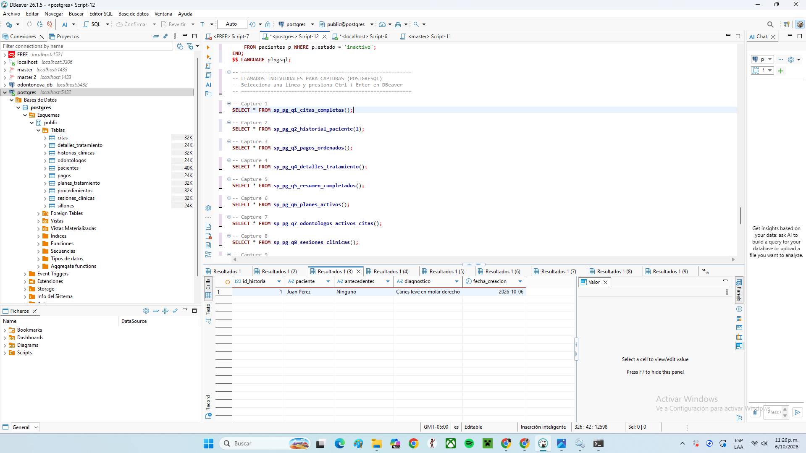

### Consulta 4: Detalles de tratamiento y procedimientos aplicados

```sql
CREATE OR REPLACE FUNCTION sp_pg_q4_detalles_tratamiento()
RETURNS TABLE (id_detalle INT, id_plan INT, procedimiento VARCHAR, costo NUMERIC, estado VARCHAR) AS $$ 
BEGIN 
    RETURN QUERY 
    SELECT d.id_detalle, d.id_plan, pr.nombre_procedimiento::VARCHAR, d.costo, d.estado::VARCHAR 
    FROM detalles_tratamiento d 
    INNER JOIN procedimientos pr ON d.id_procedimiento = pr.id_procedimiento; 
END; $$ LANGUAGE plpgsql;

SELECT * FROM sp_pg_q4_detalles_tratamiento();
```


### Consulta 5: Resumen financiero de pagos completados

```sql
CREATE OR REPLACE FUNCTION sp_pg_q5_resumen_completados()
RETURNS TABLE (total_pagos BIGINT, suma_monto NUMERIC) AS $$ 
BEGIN 
    RETURN QUERY 
    SELECT COUNT(p.id_pago), COALESCE(SUM(p.monto), 0) 
    FROM pagos p WHERE p.estado = 'completado'; 
END; $$ LANGUAGE plpgsql;

SELECT * FROM sp_pg_q5_resumen_completados();
```

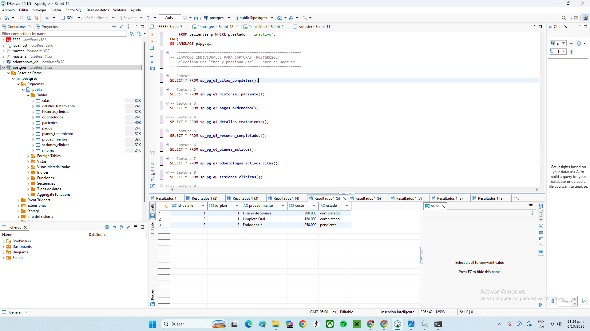

### Consulta 6: Planes de tratamiento activos

```sql
CREATE OR REPLACE FUNCTION sp_pg_q6_planes_activos()
RETURNS TABLE (id_plan INT, paciente VARCHAR, descripcion VARCHAR, estado VARCHAR) AS $$ 
BEGIN 
    RETURN QUERY 
    SELECT pl.id_plan, (p.nombre || ' ' || p.apellido)::VARCHAR, pl.descripcion::VARCHAR, pl.estado::VARCHAR 
    FROM planes_tratamiento pl 
    INNER JOIN pacientes p ON pl.id_paciente = p.id_paciente 
    WHERE pl.estado = 'activo'; 
END; $$ LANGUAGE plpgsql;

SELECT * FROM sp_pg_q6_planes_activos();
```

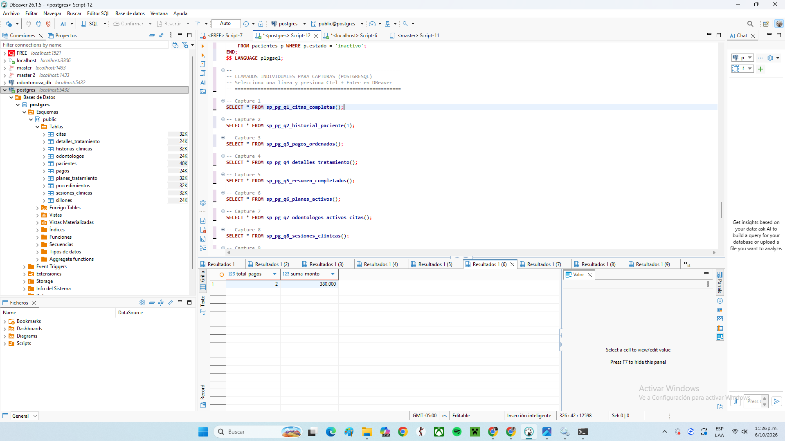

### Consulta 7: Odontólogos con citas activas

```sql
CREATE OR REPLACE FUNCTION sp_pg_q7_odontologos_activos_citas()
RETURNS TABLE (id_odontologo INT, odontologo VARCHAR, especialidad VARCHAR) AS $$ 
BEGIN 
    RETURN QUERY 
    SELECT DISTINCT o.id_odontologo, (o.nombre || ' ' || o.apellido)::VARCHAR, o.especialidad::VARCHAR 
    FROM odontologos o 
    INNER JOIN citas c ON o.id_odontologo = c.id_odontologo 
    WHERE c.estado IN ('programada', 'completada'); 
END; $$ LANGUAGE plpgsql;

SELECT * FROM sp_pg_q7_odontologos_activos_citas();
```

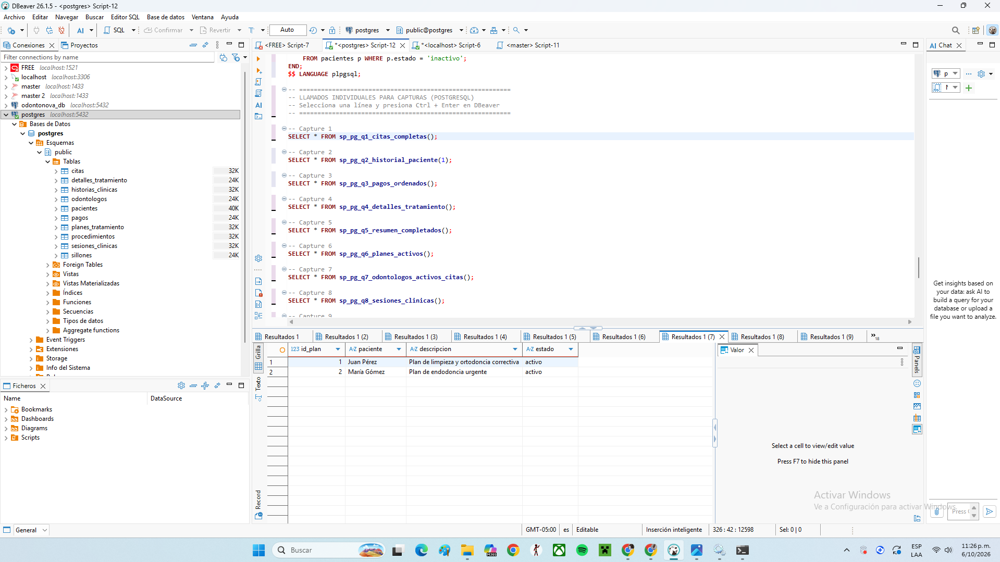

### Consulta 8: Sesiones clínicas registradas

```sql
CREATE OR REPLACE FUNCTION sp_pg_q8_sesiones_clinicas()
RETURNS TABLE (id_sesion INT, id_cita INT, observaciones VARCHAR, estado VARCHAR) AS $$ 
BEGIN 
    RETURN QUERY 
    SELECT s.id_sesion, s.id_cita, s.observaciones::VARCHAR, s.estado::VARCHAR 
    FROM sesiones_clinicas s; 
END; $$ LANGUAGE plpgsql;

SELECT * FROM sp_pg_q8_sesiones_clinicas();
```


### Consulta 9: Sillones odontológicos activos

```sql
CREATE OR REPLACE FUNCTION sp_pg_q9_sillones_activos()
RETURNS TABLE (id_sillon INT, numero_sillon VARCHAR, ubicacion VARCHAR, estado VARCHAR) AS $$ 
BEGIN 
    RETURN QUERY 
    SELECT s.id_sillon, s.numero_sillon::VARCHAR, s.ubicacion::VARCHAR, s.estado::VARCHAR 
    FROM sillones s WHERE s.estado = 'activo'; 
END; $$ LANGUAGE plpgsql;

SELECT * FROM sp_pg_q9_sillones_activos();
```

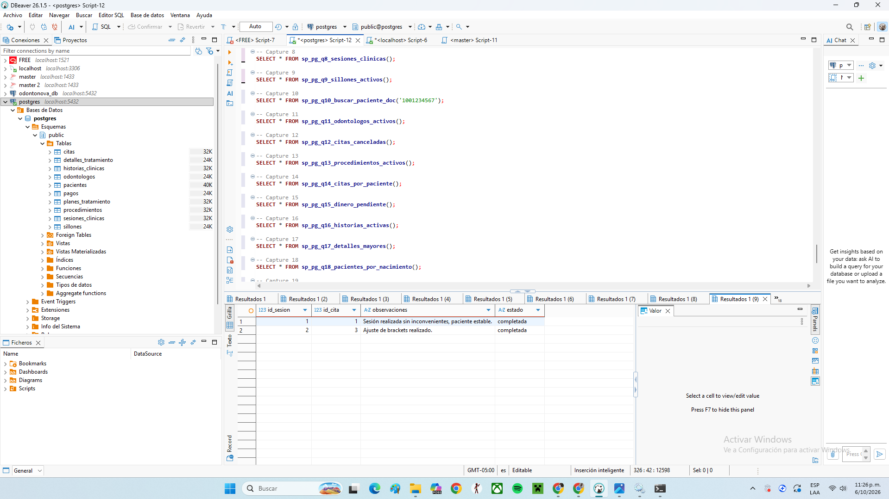

### Consulta 10: Búsqueda de paciente por documento de identidad

```sql
CREATE OR REPLACE FUNCTION sp_pg_q10_buscar_paciente_doc(p_doc VARCHAR)
RETURNS TABLE (id_paciente INT, paciente VARCHAR, documento VARCHAR, email VARCHAR) AS $$ 
BEGIN 
    RETURN QUERY 
    SELECT p.id_paciente, (p.nombre || ' ' || p.apellido)::VARCHAR, p.documento::VARCHAR, p.email::VARCHAR 
    FROM pacientes p WHERE p.documento = p_doc; 
END; $$ LANGUAGE plpgsql;

SELECT * FROM sp_pg_q10_buscar_paciente_doc('1001234567');
```


### Consulta 11: Listado general de odontólogos activos

```sql
CREATE OR REPLACE FUNCTION sp_pg_q11_odontologos_activos()
RETURNS TABLE (id_odontologo INT, odontologo VARCHAR, especialidad VARCHAR) AS $$ 
BEGIN 
    RETURN QUERY 
    SELECT o.id_odontologo, (o.nombre || ' ' || o.apellido)::VARCHAR, o.especialidad::VARCHAR 
    FROM odontologos o WHERE o.estado = 'activo'; 
END; $$ LANGUAGE plpgsql;

SELECT * FROM sp_pg_q11_odontologos_activos();
```


### Consulta 12: Citas canceladas y sus motivos

```sql
CREATE OR REPLACE FUNCTION sp_pg_q12_citas_canceladas()
RETURNS TABLE (id_cita INT, paciente VARCHAR, motivo VARCHAR, estado VARCHAR) AS $$ 
BEGIN 
    RETURN QUERY 
    SELECT c.id_cita, (p.nombre || ' ' || p.apellido)::VARCHAR, c.motivo::VARCHAR, c.estado::VARCHAR 
    FROM citas c 
    INNER JOIN pacientes p ON c.id_paciente = p.id_paciente 
    WHERE c.estado = 'cancelada'; 
END; $$ LANGUAGE plpgsql;

SELECT * FROM sp_pg_q12_citas_canceladas();
```


### Consulta 13: Catálogo de procedimientos activos

```sql
CREATE OR REPLACE FUNCTION sp_pg_q13_procedimientos_activos()
RETURNS TABLE (id_procedimiento INT, procedimiento VARCHAR, costo NUMERIC) AS $$ 
BEGIN 
    RETURN QUERY 
    SELECT pr.id_procedimiento, pr.nombre_procedimiento::VARCHAR, pr.costo 
    FROM procedimientos pr WHERE pr.estado = 'activo'; 
END; $$ LANGUAGE plpgsql;

SELECT * FROM sp_pg_q13_procedimientos_activos();
```


### Consulta 14: Total de citas acumuladas por paciente

```sql
CREATE OR REPLACE FUNCTION sp_pg_q14_citas_por_paciente()
RETURNS TABLE (paciente VARCHAR, total_citas BIGINT) AS $$ 
BEGIN 
    RETURN QUERY 
    SELECT (p.nombre || ' ' || p.apellido)::VARCHAR, COUNT(c.id_cita) 
    FROM pacientes p 
    LEFT JOIN citas c ON p.id_paciente = c.id_paciente 
    GROUP BY p.id_paciente, p.nombre, p.apellido; 
END; $$ LANGUAGE plpgsql;

SELECT * FROM sp_pg_q14_citas_por_paciente();
```

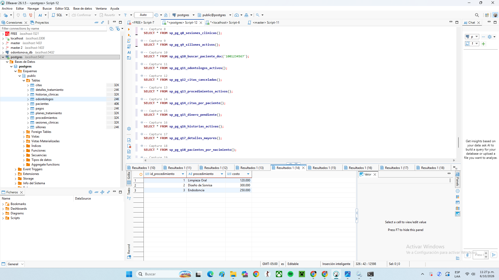

### Consulta 15: Balance de dinero pendiente por cobro

```sql
CREATE OR REPLACE FUNCTION sp_pg_q15_dinero_pendiente()
RETURNS TABLE (total_pendiente NUMERIC) AS $$ 
BEGIN 
    RETURN QUERY 
    SELECT COALESCE(SUM(p.monto), 0) 
    FROM pagos p WHERE p.estado = 'pendiente'; 
END; $$ LANGUAGE plpgsql;

SELECT * FROM sp_pg_q15_dinero_pendiente();
```

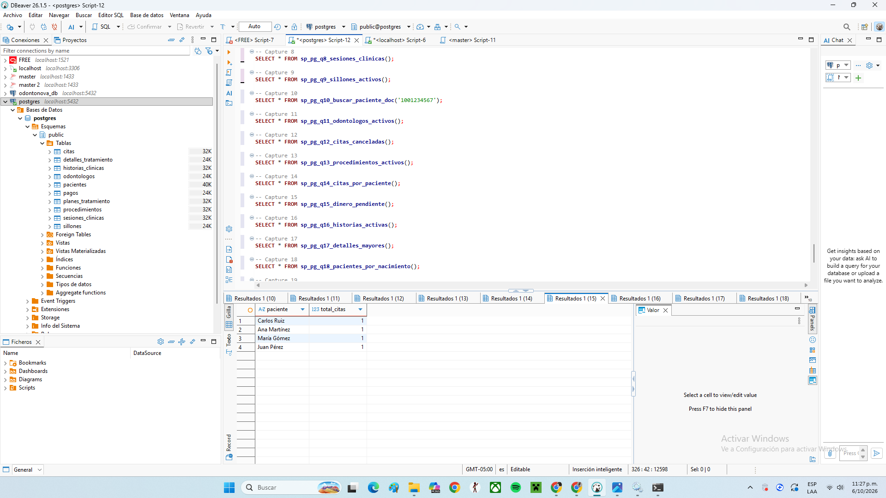

### Consulta 16: Historias clínicas activas

```sql
CREATE OR REPLACE FUNCTION sp_pg_q16_historias_activas()
RETURNS TABLE (id_historia INT, paciente VARCHAR, diagnostico VARCHAR) AS $$ 
BEGIN 
    RETURN QUERY 
    SELECT h.id_historia, (p.nombre || ' ' || p.apellido)::VARCHAR, h.diagnostico::VARCHAR 
    FROM historias_clinicas h 
    INNER JOIN pacientes p ON h.id_paciente = p.id_paciente 
    WHERE h.estado = 'activa'; 
END; $$ LANGUAGE plpgsql;

SELECT * FROM sp_pg_q16_historias_activas();
```


### Consulta 17: Detalles de tratamiento con costo superior a $150,000

```sql
CREATE OR REPLACE FUNCTION sp_pg_q17_detalles_mayores()
RETURNS TABLE (id_detalle INT, procedimiento VARCHAR, costo NUMERIC) AS $$ 
BEGIN 
    RETURN QUERY 
    SELECT d.id_detalle, pr.nombre_procedimiento::VARCHAR, d.costo 
    FROM detalles_tratamiento d 
    INNER JOIN procedimientos pr ON d.id_procedimiento = pr.id_procedimiento 
    WHERE d.costo > 150000; 
END; $$ LANGUAGE plpgsql;

SELECT * FROM sp_pg_q17_detalles_mayores();
```


### Consulta 18: Pacientes ordenados cronológicamente por fecha de nacimiento

```sql
CREATE OR REPLACE FUNCTION sp_pg_q18_pacientes_por_nacimiento()
RETURNS TABLE (id_paciente INT, paciente VARCHAR, fecha_nacimiento DATE) AS $$ 
BEGIN 
    RETURN QUERY 
    SELECT p.id_paciente, (p.nombre || ' ' || p.apellido)::VARCHAR, p.fecha_nacimiento 
    FROM pacientes p ORDER BY p.fecha_nacimiento ASC; 
END; $$ LANGUAGE plpgsql;

SELECT * FROM sp_pg_q18_pacientes_por_nacimiento();
```


### Consulta 19: Sesiones clínicas completadas

```sql
CREATE OR REPLACE FUNCTION sp_pg_q19_sesiones_completadas()
RETURNS TABLE (id_sesion INT, id_cita INT, observaciones VARCHAR) AS $$ 
BEGIN 
    RETURN QUERY 
    SELECT s.id_sesion, s.id_cita, s.observaciones::VARCHAR 
    FROM sesiones_clinicas s WHERE s.estado = 'completada'; 
END; $$ LANGUAGE plpgsql;

SELECT * FROM sp_pg_q19_sesiones_completadas();
```

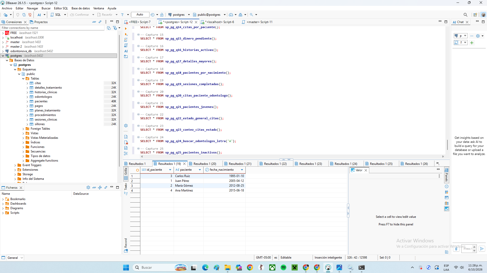

### Consulta 20: Cruce de citas con paciente y odontólogo

```sql
CREATE OR REPLACE FUNCTION sp_pg_q20_citas_paciente_odontologo()
RETURNS TABLE (id_cita INT, paciente VARCHAR, odontologo VARCHAR, fecha_hora TIMESTAMP) AS $$ 
BEGIN 
    RETURN QUERY 
    SELECT c.id_cita, (p.nombre || ' ' || p.apellido)::VARCHAR, (o.nombre || ' ' || o.apellido)::VARCHAR, c.fecha_hora 
    FROM citas c 
    INNER JOIN pacientes p ON c.id_paciente = p.id_paciente 
    INNER JOIN odontologos o ON c.id_odontologo = o.id_odontologo; 
END; $$ LANGUAGE plpgsql;

SELECT * FROM sp_pg_q20_citas_paciente_odontologo();
```


### Consulta 21: Pacientes nacidos a partir del año 2010

```sql
CREATE OR REPLACE FUNCTION sp_pg_q21_pacientes_jovenes()
RETURNS TABLE (id_paciente INT, paciente VARCHAR, fecha_nacimiento DATE) AS $$ 
BEGIN 
    RETURN QUERY 
    SELECT p.id_paciente, (p.nombre || ' ' || p.apellido)::VARCHAR, p.fecha_nacimiento 
    FROM pacientes p WHERE p.fecha_nacimiento >= '2010-01-01'; 
END; $$ LANGUAGE plpgsql;

SELECT * FROM sp_pg_q21_pacientes_jovenes();
```

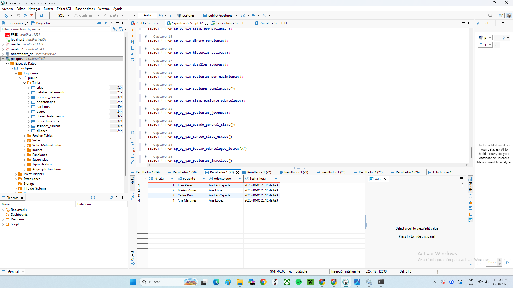

### Consulta 22: Estado general de agendamiento de citas

```sql
CREATE OR REPLACE FUNCTION sp_pg_q22_estado_general_citas()
RETURNS TABLE (id_cita INT, paciente VARCHAR, estado VARCHAR) AS $$ 
BEGIN 
    RETURN QUERY 
    SELECT c.id_cita, (p.nombre || ' ' || p.apellido)::VARCHAR, c.estado::VARCHAR 
    FROM citas c INNER JOIN pacientes p ON c.id_paciente = p.id_paciente; 
END; $$ LANGUAGE plpgsql;

SELECT * FROM sp_pg_q22_estado_general_citas();
```

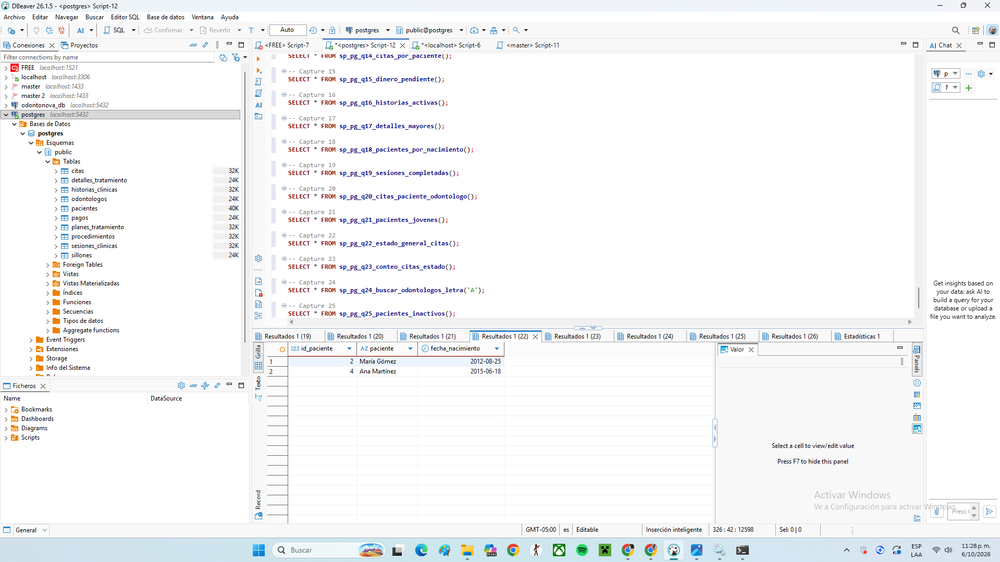

### Consulta 23: Conteo consolidado de citas agrupadas por estado

```sql
CREATE OR REPLACE FUNCTION sp_pg_q23_conteo_citas_estado()
RETURNS TABLE (estado VARCHAR, total BIGINT) AS $$ 
BEGIN 
    RETURN QUERY 
    SELECT c.estado::VARCHAR, COUNT(*) FROM citas c GROUP BY c.estado; 
END; $$ LANGUAGE plpgsql;

SELECT * FROM sp_pg_q23_conteo_citas_estado();
```

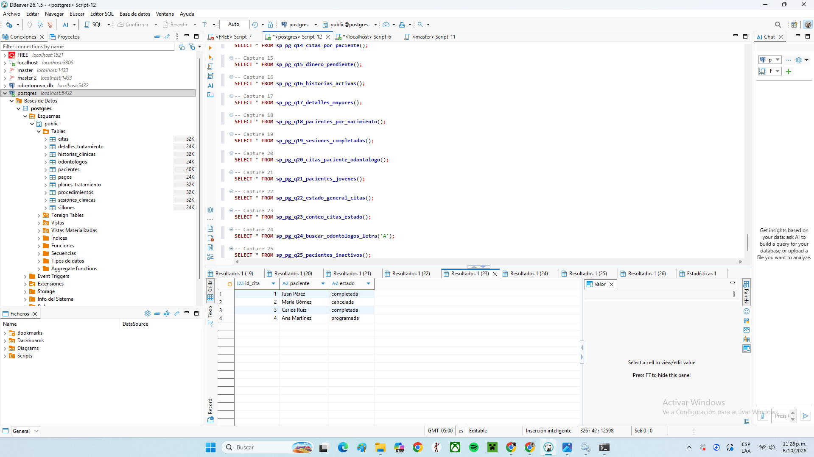

### Consulta 24: Búsqueda de odontólogos por la inicial del nombre

```sql
CREATE OR REPLACE FUNCTION sp_pg_q24_buscar_odontologos_letra(p_letra VARCHAR)
RETURNS TABLE (id_odontologo INT, odontologo VARCHAR, especialidad VARCHAR) AS $$ 
BEGIN 
    RETURN QUERY 
    SELECT o.id_odontologo, (o.nombre || ' ' || o.apellido)::VARCHAR, o.especialidad::VARCHAR 
    FROM odontologos o WHERE LOWER(o.nombre) LIKE LOWER(p_letra || '%'); 
END; $$ LANGUAGE plpgsql;

SELECT * FROM sp_pg_q24_buscar_odontologos_letra('A');
```

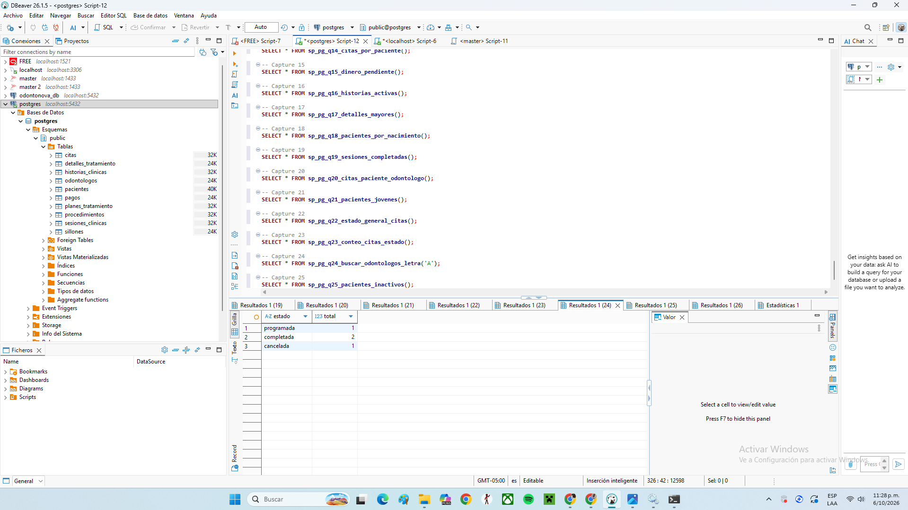

### Consulta 25: Pacientes registrados con estado inactivo

```sql
CREATE OR REPLACE FUNCTION sp_pg_q25_pacientes_inactivos()
RETURNS TABLE (id_paciente INT, paciente VARCHAR, documento VARCHAR, estado VARCHAR) AS $$ 
BEGIN 
    RETURN QUERY 
    SELECT p.id_paciente, (p.nombre || ' ' || p.apellido)::VARCHAR, p.documento::VARCHAR, p.estado::VARCHAR 
    FROM pacientes p WHERE p.estado = 'inactivo'; 
END; $$ LANGUAGE plpgsql;

SELECT * FROM sp_pg_q25_pacientes_inactivos();
```


### Evidencias de Ejecucion: Procedimientos Almacenados en MySQL 

### Consulta 1: Mostrar registros de la tabla pacientes

```sql
DROP PROCEDURE IF EXISTS sp_my_q1_pacientes //
CREATE PROCEDURE sp_my_q1_pacientes()
BEGIN
    SELECT nombre, tipo_documento, numero_documento, is_active FROM pacientes;
END //

CALL sp_my_q1_pacientes();
```

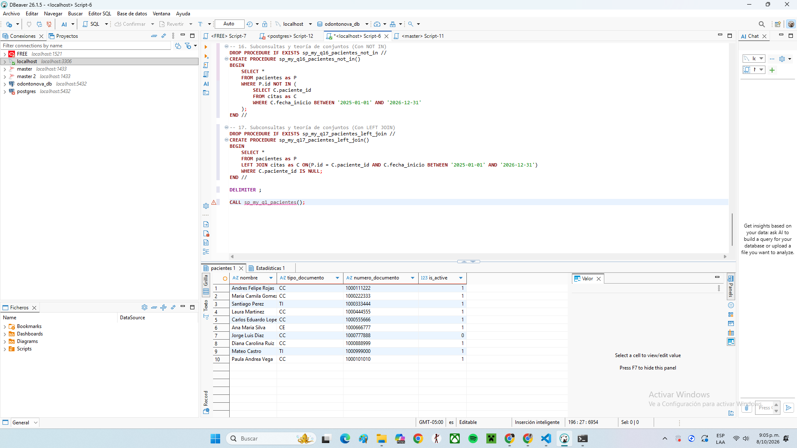

### Consulta 2: Consultas a múltiples tablas mediante WHERE

```sql
DROP PROCEDURE IF EXISTS sp_my_q2_citas_pacientes_where //
CREATE PROCEDURE sp_my_q2_citas_pacientes_where()
BEGIN
    SELECT *
    FROM citas c, pacientes p
    WHERE p.id = c.paciente_id;
END //

CALL sp_my_q2_citas_pacientes_where();
```

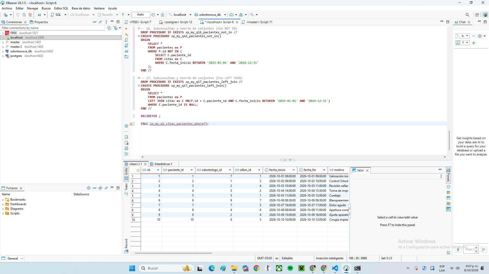

### Consulta 3: Condiciones o filtros en las consultas (WHERE implícito)

```sql
DROP PROCEDURE IF EXISTS sp_my_q3_citas_pacientes_programada //
CREATE PROCEDURE sp_my_q3_citas_pacientes_programada()
BEGIN
    SELECT *
    FROM citas c, pacientes p
    WHERE p.id = c.paciente_id AND c.estado = 'programada';
END //

CALL sp_my_q3_citas_pacientes_programada();
```

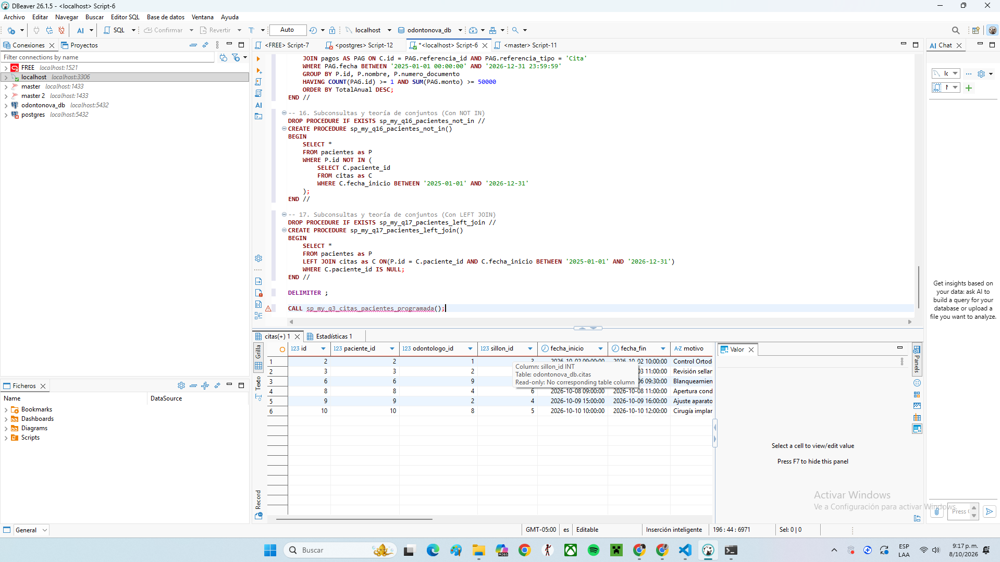

### Consulta 4: Mostrar de forma ordenada las citas (DESC)

```sql
DROP PROCEDURE IF EXISTS sp_my_q4_citas_ordenadas //
CREATE PROCEDURE sp_my_q4_citas_ordenadas()
BEGIN
    SELECT id, fecha_inicio, estado
    FROM citas
    ORDER BY fecha_inicio DESC;
END //

CALL sp_my_q4_citas_ordenadas();
```

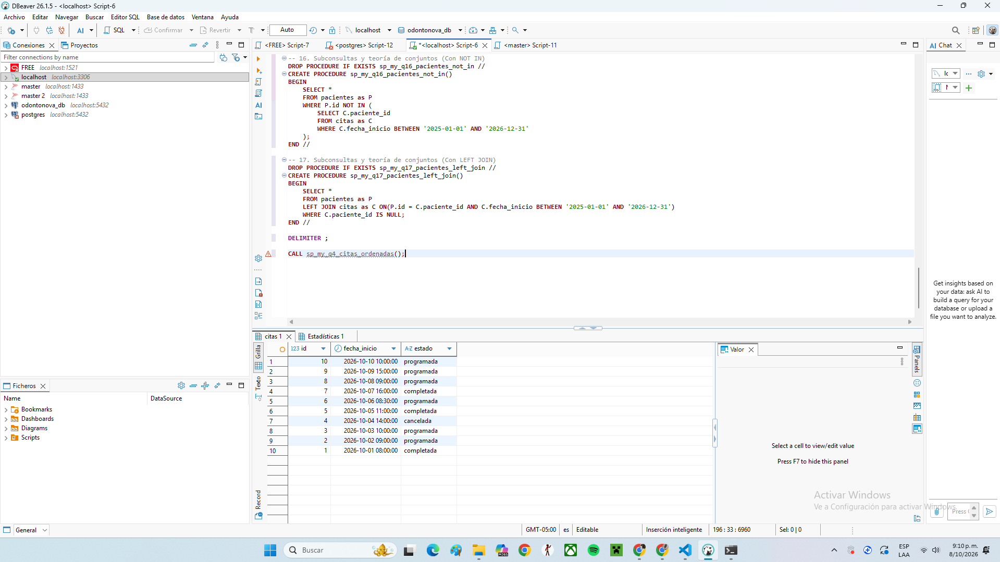

### Consulta 5: Consultas a múltiples tablas mediante JOIN (Básico)

```sql
DROP PROCEDURE IF EXISTS sp_my_q5_citas_pacientes_join //
CREATE PROCEDURE sp_my_q5_citas_pacientes_join()
BEGIN
    SELECT P.nombre, P.numero_documento, C.*
    FROM pacientes as P
    JOIN citas as C on( P.id = C.paciente_id );
END //

CALL sp_my_q5_citas_pacientes_join();
```

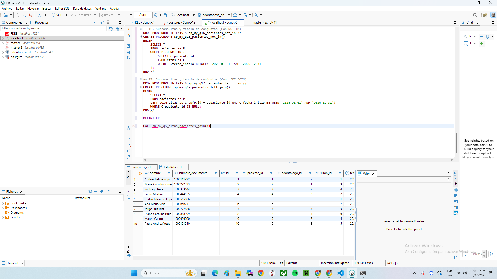

### Consulta 6: Consultas a múltiples tablas mediante JOIN (Con condición de estado)

```sql
DROP PROCEDURE IF EXISTS sp_my_q6_citas_completadas_join //
CREATE PROCEDURE sp_my_q6_citas_completadas_join()
BEGIN
    SELECT P.nombre, P.numero_documento, C.*
    FROM pacientes as P
    JOIN citas as C on( P.id = C.paciente_id )
    WHERE C.estado = 'completada';
END //

CALL sp_my_q6_citas_completadas_join();
```

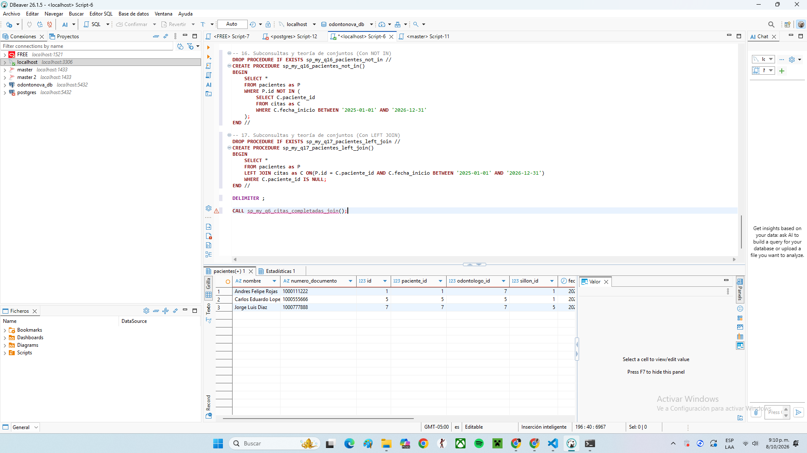

### Consulta 7: Consultas con filtro condicional LIKE (Empieza con 'M')

```sql
DROP PROCEDURE IF EXISTS sp_my_q7_pacientes_like_m //
CREATE PROCEDURE sp_my_q7_pacientes_like_m()
BEGIN
    SELECT *
    FROM pacientes as P
    WHERE P.nombre LIKE 'm%';
END //

CALL sp_my_q7_pacientes_like_m();
```

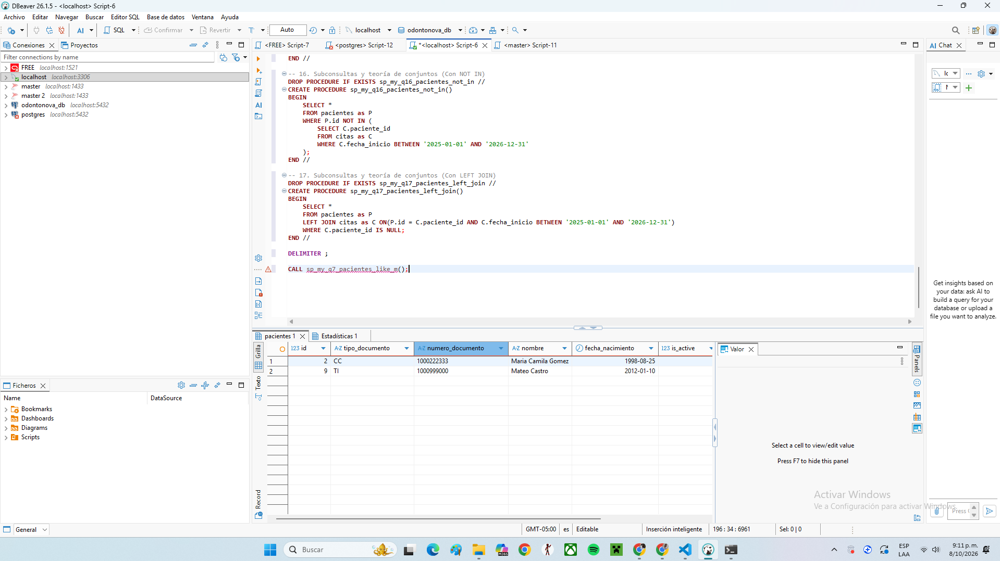

### Consulta 8: Consultas con filtro condicional LIKE (Contiene un nombre específico)

```sql
DROP PROCEDURE IF EXISTS sp_my_q8_pacientes_like_maria //
CREATE PROCEDURE sp_my_q8_pacientes_like_maria()
BEGIN
    SELECT *
    FROM pacientes as P
    WHERE P.nombre LIKE CONCAT('%','maria','%');
END //

CALL sp_my_q8_pacientes_like_maria();
```

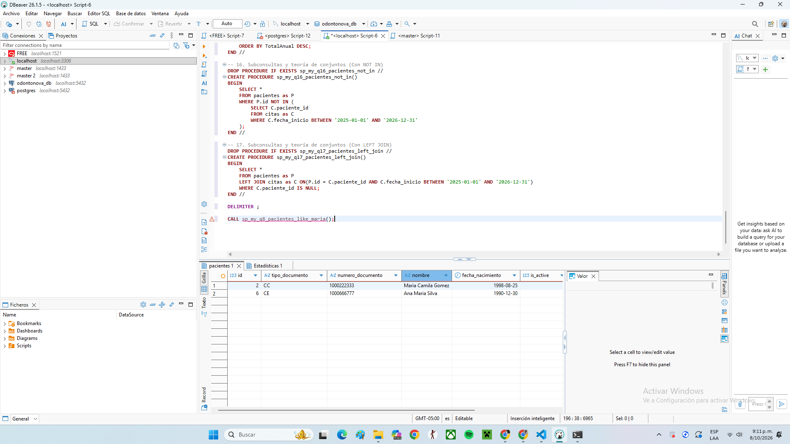

### Consulta 9: Combinación de WHERE y LIKE

```sql
DROP PROCEDURE IF EXISTS sp_my_q9_citas_programadas_like_m //
CREATE PROCEDURE sp_my_q9_citas_programadas_like_m()
BEGIN
    SELECT P.nombre, P.numero_documento, C.*
    FROM pacientes as P
    JOIN citas as C on( P.id = C.paciente_id )
    WHERE C.estado = 'programada' AND P.nombre LIKE 'm%';
END //

CALL sp_my_q9_citas_programadas_like_m();
```

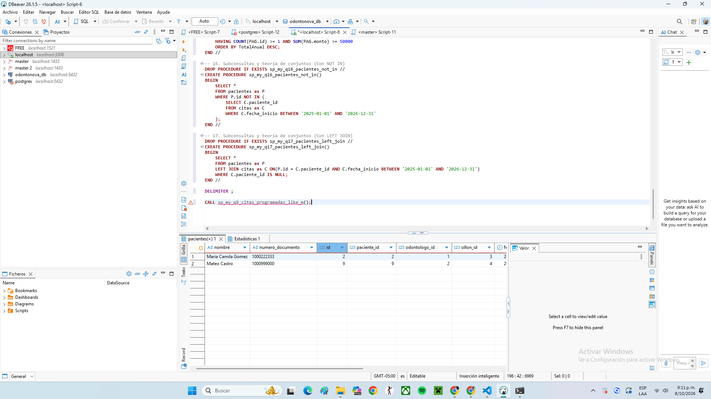

### Consulta 10: Consultas con filtros condicionales BETWEEN (Fechas de pago)

```sql
DROP PROCEDURE IF EXISTS sp_my_q10_pagos_between_join //
CREATE PROCEDURE sp_my_q10_pagos_between_join()
BEGIN
    SELECT P.nombre, P.numero_documento, C.fecha_inicio, C.estado, PAG.fecha, O.nombre AS odontologo
    FROM pacientes P
    JOIN citas C ON P.id = C.paciente_id
    JOIN pagos PAG ON C.id = PAG.referencia_id AND PAG.referencia_tipo = 'Cita'
    JOIN odontologos O ON O.id = C.odontologo_id
    WHERE PAG.fecha BETWEEN '2025-01-01 00:00:00' AND '2026-12-31 23:59:59'
    ORDER BY PAG.fecha ASC;
END //

CALL sp_my_q10_pagos_between_join();
```

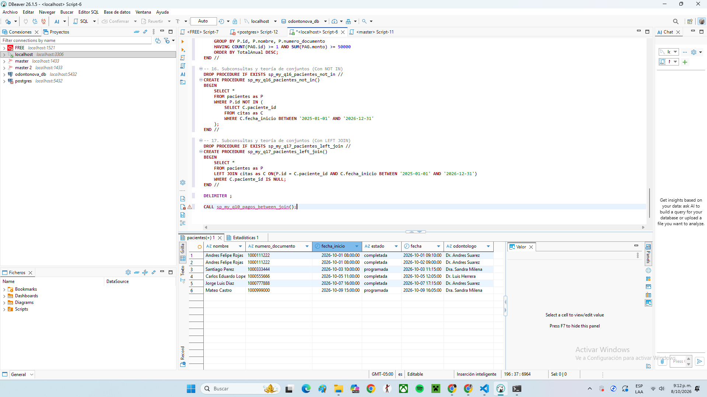

### Consulta 11: Consultas con filtros condicionales BETWEEN (Fechas de cita)

```sql
DROP PROCEDURE IF EXISTS sp_my_q11_pagos_between_where //
CREATE PROCEDURE sp_my_q11_pagos_between_where()
BEGIN
    SELECT P.nombre, P.numero_documento, C.fecha_inicio, C.estado, PAG.fecha, O.nombre AS odontologo
    FROM pacientes P, citas C, pagos PAG, odontologos O
    WHERE P.id = C.paciente_id
      AND C.id = PAG.referencia_id
      AND PAG.referencia_tipo = 'Cita'
      AND O.id = C.odontologo_id
      AND C.fecha_inicio BETWEEN '2025-01-01' AND '2026-12-31'
    ORDER BY PAG.fecha ASC;
END //

CALL sp_my_q11_pagos_between_where();
```

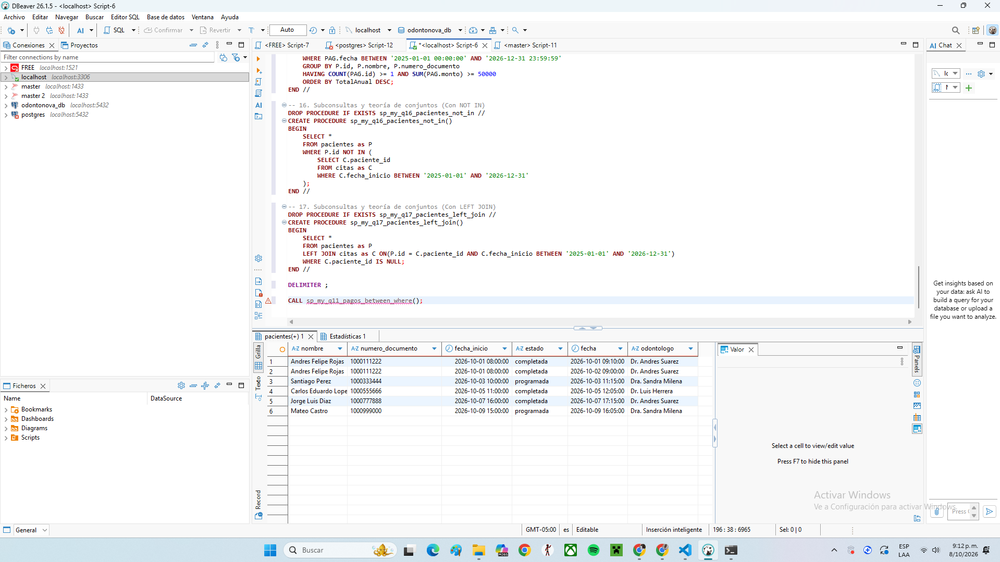

### Consulta 12: Consultas con agrupamiento GROUP BY (General)

```sql
DROP PROCEDURE IF EXISTS sp_my_q12_pagos_agrupados //
CREATE PROCEDURE sp_my_q12_pagos_agrupados()
BEGIN
    SELECT P.id, P.nombre, SUM(PAG.monto) AS TotalSuma,
           COUNT(PAG.id) AS CuentaTotal,
           AVG(PAG.monto) AS Promedio
    FROM pacientes AS P
    JOIN citas AS C ON P.id = C.paciente_id
    JOIN pagos AS PAG ON C.id = PAG.referencia_id AND PAG.referencia_tipo = 'Cita'
    WHERE PAG.fecha BETWEEN '2025-01-01 00:00:00' AND '2026-12-31 23:59:59'
    GROUP BY P.id, P.nombre
    ORDER BY TotalSuma DESC;
END //

CALL sp_my_q12_pagos_agrupados();
```

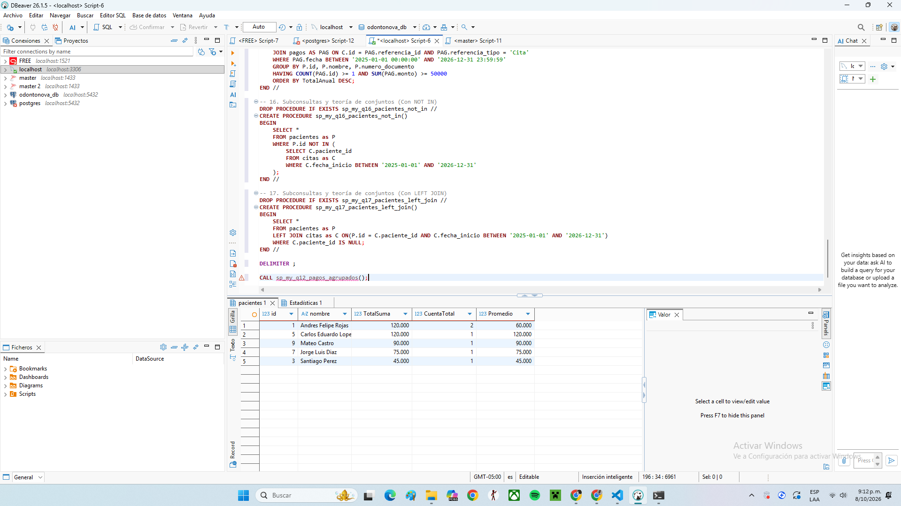

### Consulta 13: Consultas con agrupamiento GROUP BY (Filtrando por método)

```sql
DROP PROCEDURE IF EXISTS sp_my_q13_pagos_tarjeta //
CREATE PROCEDURE sp_my_q13_pagos_tarjeta()
BEGIN
    SELECT P.id, P.nombre, SUM(PAG.monto) AS TotalGasto,
           COUNT(PAG.id) AS CantidadPagos
    FROM pacientes AS P
    JOIN citas AS C ON P.id = C.paciente_id
    JOIN pagos AS PAG ON C.id = PAG.referencia_id AND PAG.referencia_tipo = 'Cita'
    WHERE PAG.estado = 'pagado' AND PAG.metodo = 'tarjeta'
    GROUP BY P.id, P.nombre
    ORDER BY TotalGasto DESC;
END //

CALL sp_my_q13_pagos_tarjeta();
```

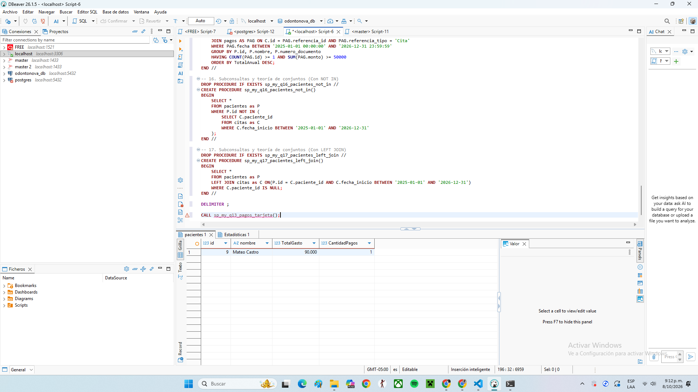

### Consulta 14: Consultas con agrupamiento HAVING (Suma de pagos)

```sql
DROP PROCEDURE IF EXISTS sp_my_q14_pagos_having //
CREATE PROCEDURE sp_my_q14_pagos_having()
BEGIN
    SELECT P.id, P.nombre, SUM(PAG.monto) AS TotalSuma,
           AVG(PAG.monto) AS PromedioPago
    FROM pacientes AS P
    JOIN citas AS C ON P.id = C.paciente_id
    JOIN pagos AS PAG ON C.id = PAG.referencia_id AND PAG.referencia_tipo = 'Cita'
    GROUP BY P.id, P.nombre
    HAVING SUM(PAG.monto) >= 50000
    ORDER BY TotalSuma DESC;
END //

CALL sp_my_q14_pagos_having();
```

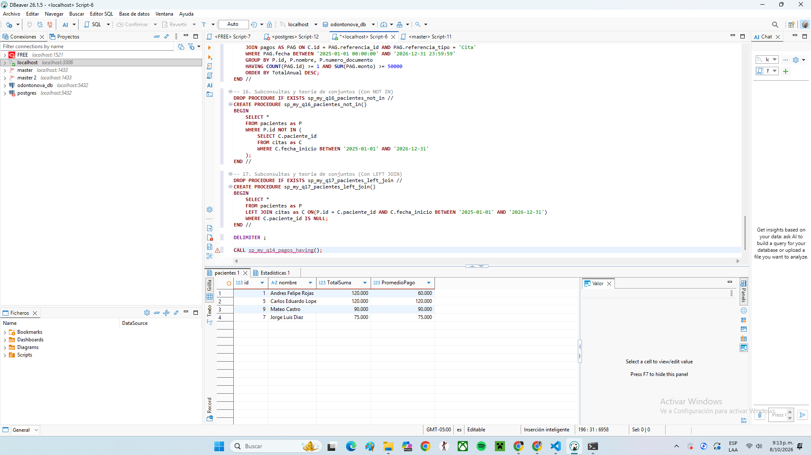

### Consulta 15: Consultas con agrupamiento HAVING (Combinado)

```sql
DROP PROCEDURE IF EXISTS sp_my_q15_pagos_having_combinado //
CREATE PROCEDURE sp_my_q15_pagos_having_combinado()
BEGIN
    SELECT P.id, P.nombre, P.numero_documento, SUM(PAG.monto) AS TotalAnual,
           COUNT(PAG.id) AS TotalPagos
    FROM pacientes AS P
    JOIN citas AS C ON P.id = C.paciente_id
    JOIN pagos AS PAG ON C.id = PAG.referencia_id AND PAG.referencia_tipo = 'Cita'
    WHERE PAG.fecha BETWEEN '2025-01-01 00:00:00' AND '2026-12-31 23:59:59'
    GROUP BY P.id, P.nombre, P.numero_documento
    HAVING COUNT(PAG.id) >= 1 AND SUM(PAG.monto) >= 50000
    ORDER BY TotalAnual DESC;
END //

CALL sp_my_q15_pagos_having_combinado();
```

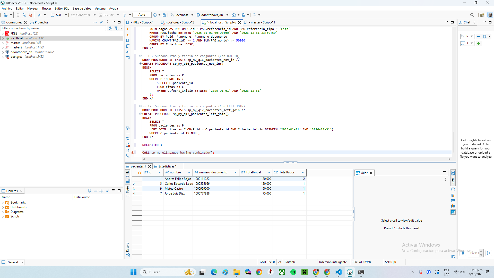

### Consulta 16: Subconsultas y teoría de conjuntos (Con NOT IN)

```sql
DROP PROCEDURE IF EXISTS sp_my_q16_pacientes_not_in //
CREATE PROCEDURE sp_my_q16_pacientes_not_in()
BEGIN
    SELECT *
    FROM pacientes as P
    WHERE P.id NOT IN (
        SELECT C.paciente_id
        FROM citas as C
        WHERE C.fecha_inicio BETWEEN '2025-01-01' AND '2026-12-31'
    );
END //

CALL sp_my_q16_pacientes_not_in();
```

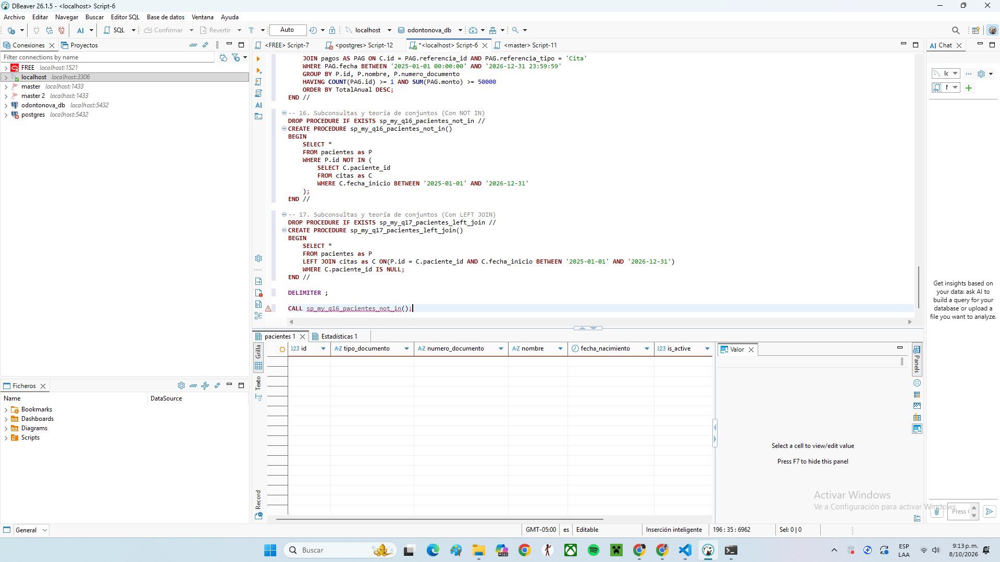

### Consulta 17: Subconsultas y teoría de conjuntos (Con LEFT JOIN)

```sql
DROP PROCEDURE IF EXISTS sp_my_q17_pacientes_left_join //
CREATE PROCEDURE sp_my_q17_pacientes_left_join()
BEGIN
    SELECT *
    FROM pacientes as P
    LEFT JOIN citas as C ON(P.id = C.paciente_id AND C.fecha_inicio BETWEEN '2025-01-01' AND '2026-12-31')
    WHERE C.paciente_id IS NULL;
END //

CALL sp_my_q17_pacientes_left_join();
```

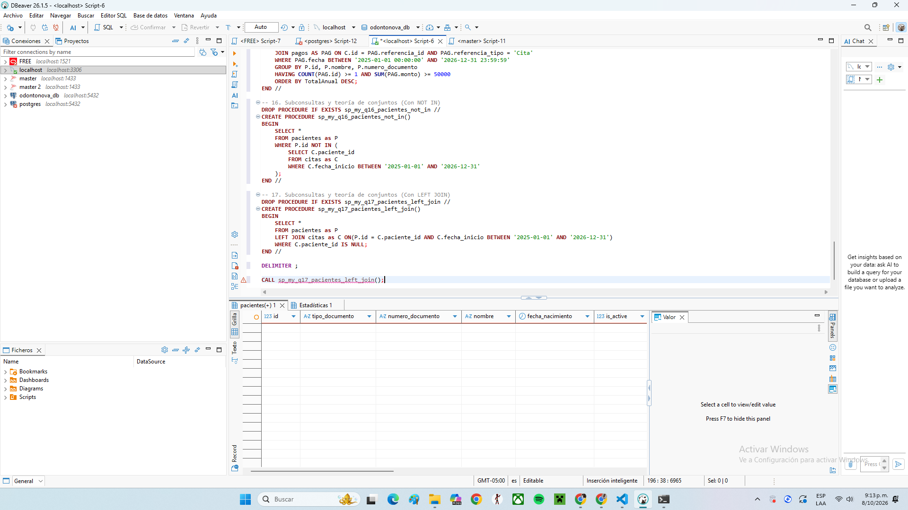
